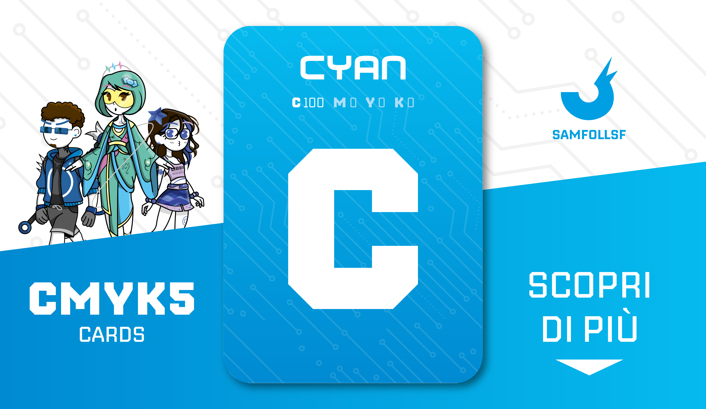

# Carta "Ciano"

Carta al 100% Ciano, indispensabile per la sintesi sottrattiva. Il tema di questo mazzo è il minimal e la tecnologia.

Usa la lista di Sinistra per scoprire tutte le carte dal colore prevalentemente Ciano!

## Colore

Insieme al magenta e giallo, concorre a creare tutte le altre tonalità. Dal greco "kýanos", un colore ricavato dai lapislazzuli, sarà stato proprio Ciano il vestito di "Alice nel paese delle meraviglie"?

# Versione Mazzo 1.0