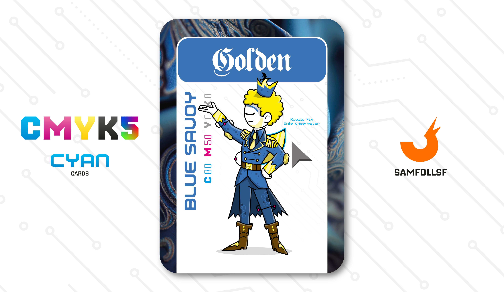

---
tags:
  - Dimensione Z

...

# Golden

## Descrizione

Il Principe del Network 57. Ha partecipato attivamente a iniziative per la riqualificazione urbana e a manifestazioni contro la criminalità locale. Golden ci introduce come ogni Network abbia una propria amministrazione indipendnete, non solo gestita da figure legate al Web nativamente, ma anche da Agent o Manager. Nel suo caso specifico, la sua figura è quella di un principe, un'autorità che non ha nulla a che fare con gli [Ordini Metallici](../Remix/metal.md) o con i [Web Crystals](../Remix/crystal.md), ma è puramente di natura politica.

Tuttavia i Principi hanno dalla loro possibilità ugualmente formidabili. Dispongono di un esercito, di numerosissimi privilegi nel loro Network che spaziano dalla grazia per chi commette dei reati, all'accesso in ogni singola struttura del quartiere, arrivando al caveau del proprio Network: quelli più umili contengono [Argento](../Remix/metal.md) e [Oro](../Remix/metal.md) (nel caso di Golden), mentre quelli che si trovano in zone prestigiose del [Surface Web](../Remix/deep.md) ospitano montagne di [Diamanti Azzurri e Rosa](../Remix/crystal.md) e [Lingotti di Platino](../Remix/metal.md) fino all'80% di Purezza in quantità industriali. Se mai un Agent o Manager dovesse usare queste ricchezze per conquistare Network altrui, si scatenerebbe una vera e propria guerra civile apocalittica.

## Colore

Il Blu Savoia è in realtà una sfumatura di azzurro. Deve il suo nome al fatto di esser stato il colore di Casa Savoia, dinastia regnante in Italia dal 1861 fino al 1946.

## Curiosità

- Selezione: La pinna che indossa sulla schiena non è solo un elemento decorativo, gli permette di muoversi con molta agilità sott'acqua, essendo il blocco 137 vicino ai grandi [Ristagni d'Acqua](../Remix/frutiger.md).
- Sulla sua corona è presente un delfino, simbolo di legame con l'acqua.
- Come hobby pratica la modellazione 3D su Blender, tema discusso ampiamente nelle carte di [Androzz](../Magenta/androzz.md) e [Marwis](../Ciano/marwis.md).

# Volume V: COUNTER-CULTURE MOTOR SHOW