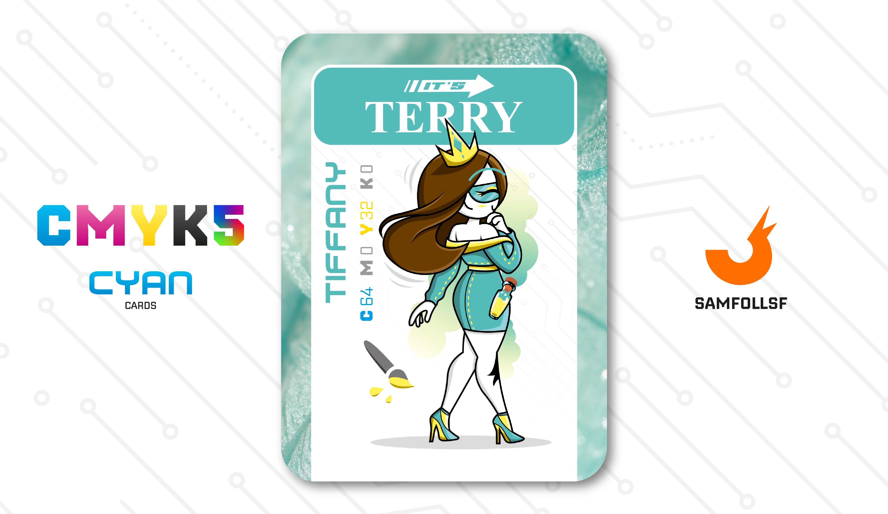

---
tags:
  - B&W

...

# It's Terry

## Descrizione

It's Terry è una maître parfumeur per Tiffany & Co. Anche nel mondo digitale, gli Agent possono percepire gli odori di oggetti e di altri colleghi, e il settore dei profumi è molto in voga. Da circa quattro anni, It's Terry si dedica alla creazione di fragranze, un lavoro che gli ha permesso di raggiungere una posizione sociale di prestigio, evidente anche dal suo vestiario altolocato.

## Colore

Come dimenticare "Colazione da Tiffany" e quel colore che Charles Lewis Tiffany ricercò a emblema del suo negozio e delle scatole dei suoi gioielli? Questa tonalità ha un suo copyright, in quanto prodotta dall'azienda statunitense Pantone con numero PMS 1837. Il numero indica l'anno di nascita di Tiffany.

## Curiosità

- Fa parte, come [Its Martin](../Giallo/martin.md) della It's Web Company, una comunità di alleanza segreta fra gli Agent che utilizzano varchi clandestini per il [Deep Web](../Remix/deep.md).
- Nella sua carta è possibile vedere una boccietta di profumo che porta sempre con sè.
- Ha lavorato in passato per la B&W proprio come maître parfumeur. B&W è una società che si muove nei settori più raffinati, dalla moda alle discpline artistiche come la danza.
- È admin di un blog di pettegolezzi, non a caso [SamFollSF](../Remix/samfollsf.md) l'ha salvata fra i suoi contatti come "Terry degli Inciuci" (Cosa realmente accaduta).
- It's Terry è l'Agent di Teresa De Angelis.

# Versione Mazzo 1.0