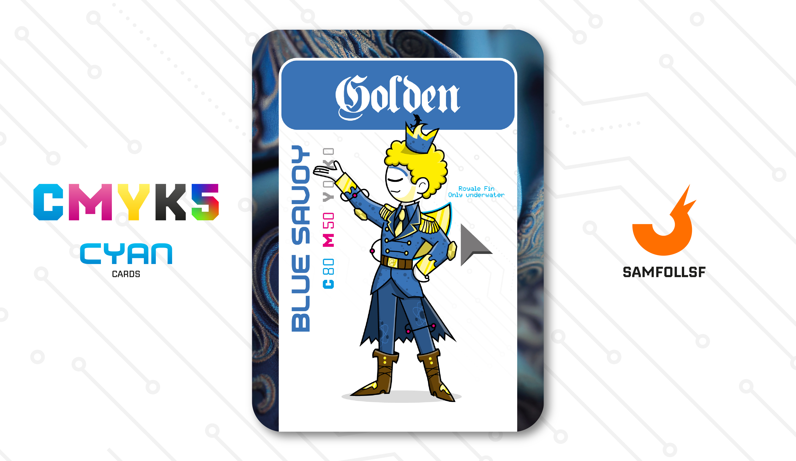

---
tags:
  - Frutiger Age

...

# Golden

## Descrizione

Il Principe del Blocco 137. Ha partecipato attivamente a iniziative per la riqualificazione urbana e a manifestazioni contro la criminalità locale. Golden ci introduce come ogni blocco ha una propria sotto-governanza, non solo gestita da figure legate al Web nativamente, ma anche da Agent o Manager. Nel suo caso specifico, la sua figura è quella di un principe, un'autorità che non ha nulla a che fare con gli [Ordini Metallici](../Remix/metal.md) o con i [Web Crystals](../Remix/crystal.md), ma è puramente di natura politica.

## Colore

Il Blu Savoia è in realtà una sfumatura di azzurro. Deve il suo nome al fatto di esser stato il colore di Casa Savoia, dinastia regnante in Italia dal 1861 fino al 1946.

## Curiosità

- Selezione: La pinna che indossa sulla schiena non è solo un elemento decorativo, gli permette di muoversi con molta agilità sott'acqua, essendo il blocco 137 vicino ai grandi [Ristagni d'Acqua](../Remix/frutiger.md).
- Sulla sua corona è presente un delfino, simbolo di legame con l'acqua.
- Come hobby pratica la modellazione 3D su Blender, tema discusso ampiamente nelle carte di [Androzz](../Magenta/androzz.md) e [Marwis](../Ciano/senatore.md).
- Golden è l'Agent di Renato Iuffredo.

# Versione Mazzo 1.0