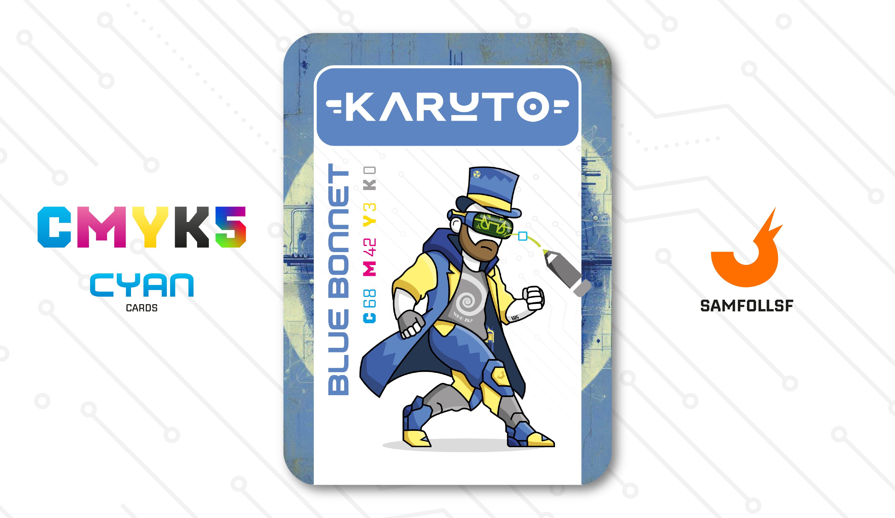

---
tags:
  - Red Winter

...

# Kàruto

## Descrizione

Impossibile non dare spazio all'Atompunk. Pur non facendo direttamente parte dell'Operazione Red Winter, mantiene stretti contatti con essa. La sua principale mansione è convertire file in diversi formati (ad esempio, da .AI a .ESP). In effetti è un lavoro del tutto leggittimo, tuttavia non perde occasione per spingeri a comprimere file in modo proibito, offrendo un servizio molto particolare: Kàruto è in grado di comprimere file e oggetti di contrabbando in formati così ridotti da risultare impossibili da individuare per le dogane e le forze di polizia.

## Colore

Il Blu Bonnet era un copricapo di lana usato, dalla fine del XVI secolo, da contadini e lavoratori scozzesi. Il suo caratteristico colore, nell'intersezione tra grigio e blu, divenne il simbolo dei "Covenanters", i seguaci del movimento politico e religioso scozzese del XVII secolo.

## Curiosità

- Gestisce un business di siti in Mkdown appoggiati su GitHub, una miniera d'oro a lui sconosciuta fino a cinque mesi fa che si è rilevata essere molto redditizia. Ogni tanto [SamFollSF](../Remix/samfollsf.md) si propone per dargli una mano in cambio di una percentuale sul ricavato.
- Indossa un VR Atompunk, un mix molto strano simile al Pip Boy di Fallout.
- Sul suo vestito è presente una spirale che fa riferimento all'immagine di profilo su Whatsapp.
- In passato faceva parte di un Clan di Sicari, l'[HotRide](../Magenta/ilpanettone.md).
- Kàruto è l'Agent di Carmine Carotenuto.

# Versione Mazzo 1.0