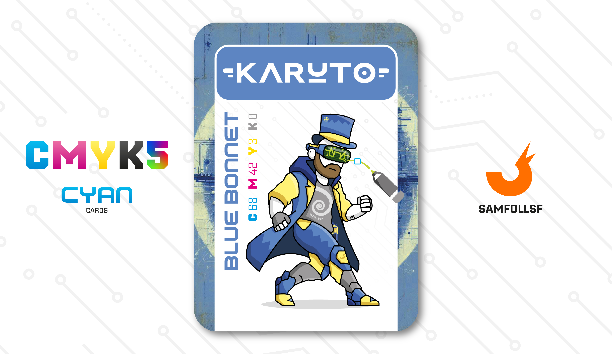

---
tags:
  - Red Winter

...

# Kàruto

## Descrizione

Impossibile non dare spazio all'Atompunk. Pur non facendo direttamente parte dell'Operazione Red Winter, mantiene stretti contatti con essa. La sua principale mansione è convertire file in diversi formati (ad esempio, da .AI a .ESP) oppure comprimerli per conto di piccole realtà di consegna file. È un lavoro del tutto leggittimo, tuttavia Kàruto non perde occasione per spingersi ad usare metodi di compressione proibiti, offrendo un servizio unico: egli è in grado di ridimensionare file e oggetti di contrabbando in formati così ridotti da risultare impossibili da individuare per le dogane e le forze di polizia.

## Colore

Il Blu Bonnet era un copricapo di lana usato, dalla fine del XVI secolo, da contadini e lavoratori scozzesi. Il suo caratteristico colore, nell'intersezione tra grigio e blu, divenne il simbolo dei "Covenanters", i seguaci del movimento politico e religioso scozzese del XVII secolo.

## Curiosità

- Ogni tanto [SamFollSF](../Remix/samfollsf.md) si propone per dargli una mano in cambio di una percentuale sul ricavato. In passato hanno collaborato per creare repository in serie, ottenendo un discreto successo in termini di guadagni.
- Indossa un VR Atompunk, un mix molto strano simile al Pip Boy di Fallout.
- Sul suo vestito è presente una spirale che fa riferimento all'immagine di profilo su Whatsapp.

# Volume IV: RED WINTER