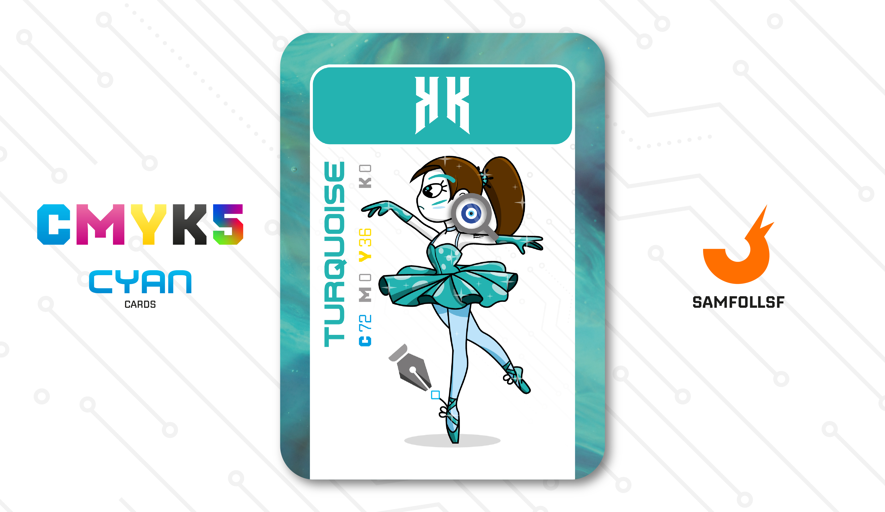

---
tags:
  - B&W

...

# KK

## Descrizione

Nel Web, nonostante la criminalità, la corruzione, la morte e le guerre, c'è ancora spazio per l'arte e la cultura, e la danza non fa eccezione. Non sono molte le ballerine che scelgono questa strada, poiché è un servizio accessibile solo all'élite del Web, a chi ha denaro e tempo per godersi uno spettacolo. Tuttavia, può rivelarsi estremamente redditizio per chi riesce ad entrare nei circuiti degli spettacoli più importanti.

La sua compagnia di danza è la B&W, una grande realtà che occupa diversi settori fra i più raffinati, dalla moda alle discipline artistiche come la danza. È dipendente qui da circa 10 anni.

## Colore

Blu tendente al verde, il Turchese è fresco e vivace, perfetto per la stagione calda. Il nome deriva da questa gemma molto apprezzata sin dall'antichità: troviamo testimonianze già presso Egizi, Maya e Aztechi. Plinio la definiva callaina.

## Curiosità

- È completamente al di fuori di quello che [Angy](../Giallo/angy.md) fa nei palazzi della Web Intelligence, trova il tutto estremamente noioso.
- Uno dei suoi orecchini è un occhio greco.
- Il suo codino è un timone, riferimento sia al fatto che sà nuotare sià al Fidget Spinner reale del 2017.
- KK è l'Agent di Francesca Amirata.

# Versione Mazzo 1.0