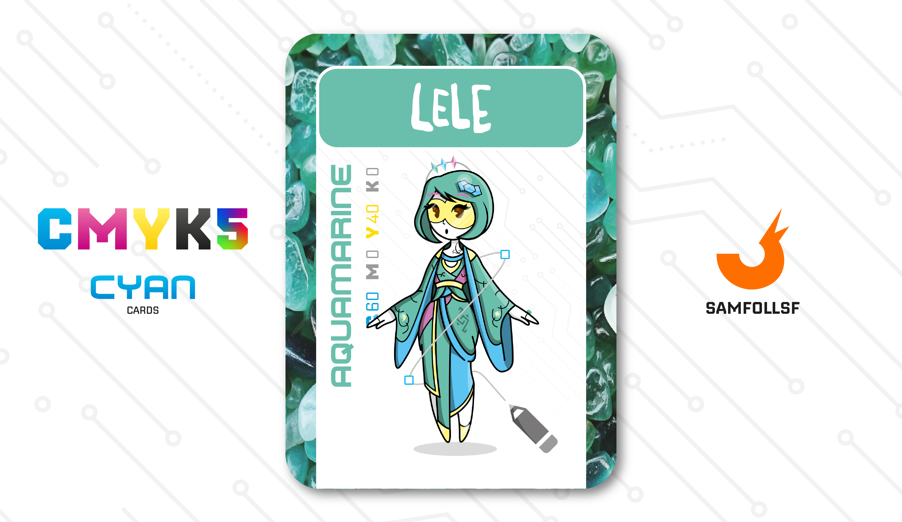

---
tags:
  - Snoctix.inc

...

# Lele

## Descrizione

Lele, soprannominata la "Dea di Cristallo" per via del suo possesso di 5 miniere volte all'estrazione di [Web Crystals](../Remix/crystal.md), è un'artigiana di accessorri estetici e di armi realizzate con questi cristalli. Nel [Surface Web](../Remix/deep.md) non è illegale esserne in possesso, è il loro utilizzo ad essere soggetto a molte restrizioni. Ogni cristallo ha il suo potere unico, più se ne hanno e più si sarà potenti. Come [Brioche33](../Magenta/santin.md) e [PickMeGiuls](pistilli.md) anche lei è affiliata alla [Snoctix.inc](../Magenta/solisnoctix.md) che gestisce e detiene in parte i suoi averi.

## Colore

L'Acquamarina nasce in natura sotto forma di cristalli esagonali (la più grande, ritrovata all'inizio del Novecento, pesava 110 chili ed era lunga quasi mezzo metro). Plinio diceva che le più belle, una volta immerse nel mare, non avrebbero potuto distinguersi dal resto. È la pietra dell'estate, in tutti i sensi!

## Curiosità

- Anche se non si direbbe dal colore della carta, il suo colore preferito è il Viola.
- Sul suo vestito è presente il logo di appartenenza alla Snoctix.inc.
- Nel tempo libero passeggia sulle rive dei grandi [Ristagni d'Acqua](../Remix/frutiger.md) alla ricerca di vetrini che può usare per i suoi accessori estetici.
- Ha un notevole autocontrollo ed eleganza nel porsi, anche se in alcuni casi dei fastidiosissimi [SamFollSF](../Remix/samfollsf.md) tirano molto la corda, fidatevi nessuno vorrebbe vederla incazzata.
- Ha sul collo un tatoo di un uccello.
- Lele è l'Agent di Alessia Cozzolino.

# Versione Mazzo 1.0