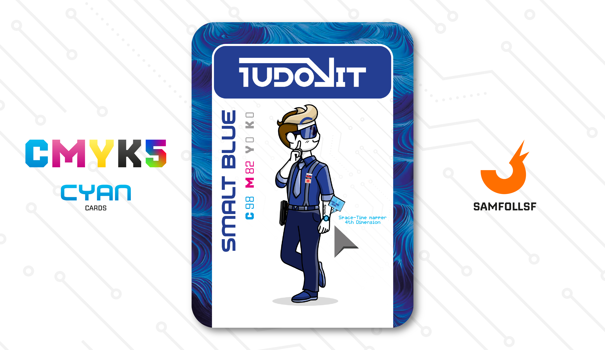

---
tags:
  - Red Winter

...

# 1udovìt

## Descrizione

Agente dell'Operazione [Red Winter](../Magenta/alesdreams.md) specializzato nell'identificare [Chiavi Quadridimensionali](../Remix/tool.md) ottenute illegalmente. Attraverso il suo speciale orologio riesce a tenere sotto controllo la quarta dimensione, potendo individuare velocemente se vi sono movimenti sospetti tra le dimensioni. Ha ottenuto questo lavoro tramite il reclutamento da parte di [Ales Dreams](../Magenta/alesdreams.md), ma ne parleremo meglio nella sua carta.

## Colore

Nel 1884 il Blu Elettrico viene coniato per descrivere la sfumatura caratteristica proveniente dai lampi. È quel tocco di stravaganza senza rivoluzione, amato da molte case di moda storiche

## Curiosità

- Anche quando è in servizio, 1udovìt è un grandissimo PlayBoy, rizzer per eccellenza. Non a caso nella sua carta ha la posa del mewing.
- Sul suo avanbraccio sinistro è presente un tatoo della data di nascita di Ludovico, il motivo per il quale ho deciso di implementare questo dettaglio possiamo capirlo solo io e lui.
- Parla perfettamente Slovacco e mastica un po' di Ceco. Mentre per esigenze lavorative è costretto ad avere delle basi di Russo.
- 1udovìt è l'Agent di Ludovico Gigliano

# Versione Mazzo 1.0