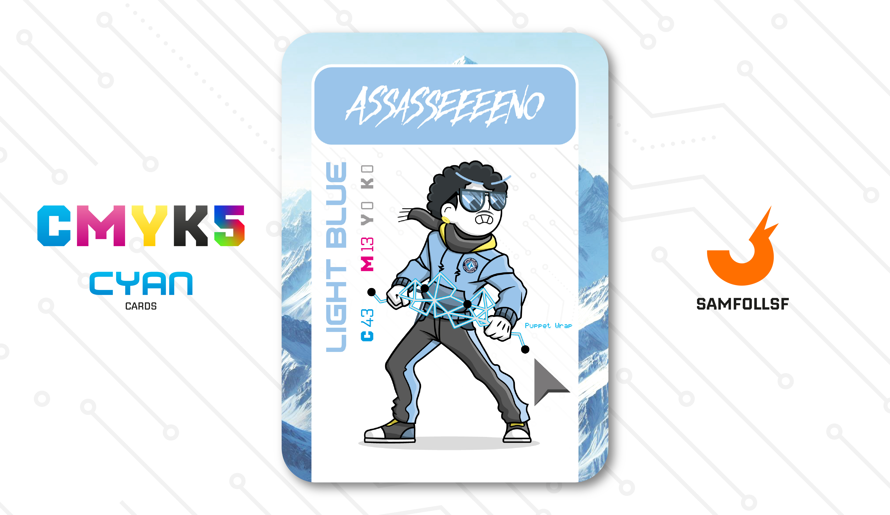

---
tags:
  - The Other Side

...

# Assasseeeeno

## Descrizione

Nel [Deep Web Esposto](../Remix/deep.md), i supervisori non sono solo i [Bruti Dorati](../Remix/metal.md), ma includono anche Agent incaricati di monitorare i movimenti di altri Agent e Manager che accedono a questa regione del Web. Questi supervisori forniscono indicazioni e comunicazioni a chi transita in questa zona. Tra loro c'è Assasseeeeno, che segretamente collabora con [Brioche33](../Magenta/santin.md) e [PickMeGiuls](../Ciano/pistilli.md), fornendo loro informazioni sui cambiamenti interni alla sicurezza.

## Colore

Insieme al tricolore è sicuramente il simbolo dell'Italia, ma perché? Tutto partì nel 1366 quando i Savoia, in viaggio per la Terra Santa, presentarono al mondo un drappo azzurro in onore alla Madonna. Simbolo sabaudo, venne poi usato anche nelle prime bandiere tricolori e infine in quella del Regno d'Italia.

## Curiosità

- Come [Tulipana](../Giallo/del.md) anche lui utilizza più nomi diversi nel Web
- PLACE HOLDER
- Lo stile della carta segue l'old cartoon vintage di [OpsGiuly](../Nero/opsg.md) e [Suunnrise](../Nero/giada.md).
- PLACE HOLDER
- Assasseeeeno è l'Agent di Domenico Racca.

# Versione Mazzo 1.0