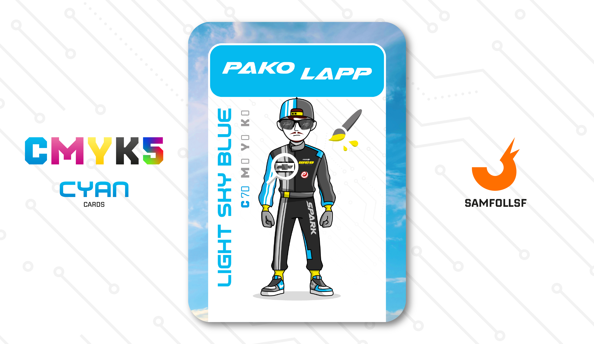

---
tags:
  - Mila Giri

...

# Pako Lapp

## Descrizione

Anche se si sta parlando di un mondo digitale le 4 ruote non possono mancare. Esse vengono usate per spostamenti lunghi nella megatropoli del [Surface Web](../Remix/deep.md). PakoLapp lavora come dipendente in un concessionario di auto di lusso di grande prestigio, L'Imperium Space. Tuttavia, nel tempo libero non si fa scappare la possibilità di partecipare a gare clandestine con i suoi amici.

## Colore

Celeste è il mantello della Vergine nei dipinti di arte sacra del Rinascimento; è il cielo parigino di Kandinsky nel suo celebre dipinto "Azzurro Cielo" e celeste è anche lo sfondo che rende fieri "I valori personali di Magritte". Celeste è pace. È perfetto per la palette Spring!

## Curiosità

- Pako è amante della fotografia, che a differenza del nostro mondo lì è un settore ancora in grande voga. Oltre a fotografare auto per lavoro, i soggetti delle sue foto sono anche vicoli malridotti della metropoli.
- Sui suoi occhiali è presente il nome PA - KO.
- Gli sponsor che ha sulla sua tuta sono: Chevrolet (Spark), It's WCO ed E-cola.
- Ha un numero spropositato di ore su Grand Theft Auto V, perché sì anche gli Agent giocano ai videogiochi.
- Sà parlare perfettamente lo Spagnolo.
- Pako Lapp è l'Agent di Pasuale Lappone.

# Versione Mazzo 1.0