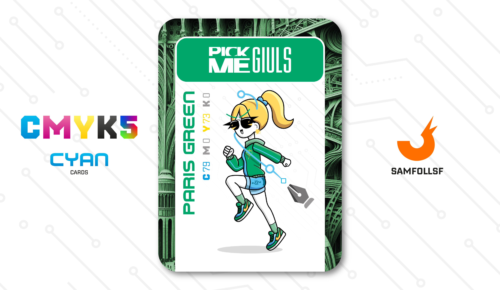

---
tags:
  - Snoctix.inc

...

# PickMeGiuls

## Descrizione

Insieme a [Brioche33](../Magenta/santin.md) svolge un'attività illegalissima, ovvero il furto di dati sensibili, sotto il nome in codice di "Lair". I clienti che scelgono di utilizzare questi servizi non sono sempre criminali, ma includono anche Agent che sospettano di essere traditi o che temono di essere vittime di un complotto contro di loro. Dopo l'acquisizione da parte della [Snoctix.inc](../Magenta/solisnoctix.md) i guadagni e la popolarità di questo business sono decisamente aumentati.

## Colore

Il Verde di Parigi è un colore particolare che spopolava in mezza Europa, ma ricordato come "di Parigi" per averne derattizzato le fogne. Veniva infatti prodotto con un agente chimico che conteneva una piccola parte di arsenico. Qualcuno ipotizzò potesse anche essere pericoloso sin dal 1839, ma era così richiesto!

## Curiosità

- Conosce di persona l'Agent di Tedua, anche se come vedremo più avanti non sono altro che normalissimi Agent come altri senza una popolarità rilevante ([Maggiori informazioni Qui](../Giallo/geadamn.md)).
- All'interno del "Lair" ha un bar privato dove può prendersi un cappuccino a qualunque ora del giorno.
- Nella carta è attraversata da un Link, che come potete vedere non possono essere toccati ma solo visti, potendo attraversare i corpi degli abitanti del Web senza problemi.
- PickMeGiuls è l'Agent di Giulia Pistilli.

# Versione Mazzo 1.0