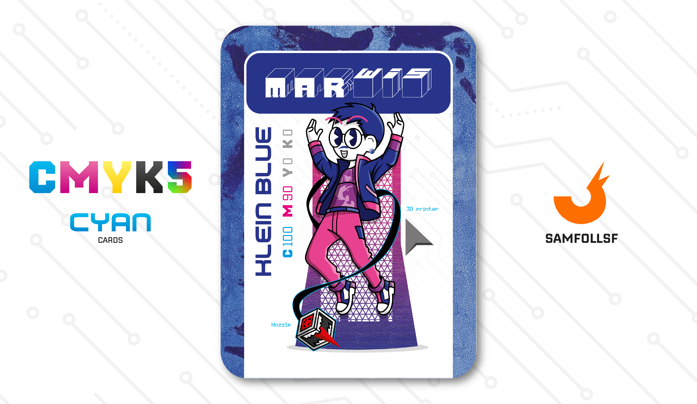

---
tags:
  - Pantera

...

# Marwis

## Descrizione

Il PLA, nel contesto del Web, si distingue per alcune caratteristiche uniche. Come i metalli e i cristalli, non rientra nella sintesi sottrattiva dei colori e si colloca al di sotto di essi in termini di potenza, tanto da non esserci nemmeno nell’[Ordine del potere](../index.md). Questo potrebbe far pensare che non sia degno di nota. Tuttavia, ciò che rende questo materiale interessante è la sua versatilità e capacità di serializzazione.

Nel Web, la possibilità di creare armi di ogni forma rappresenta un vantaggio, soprattutto per il commercio di questi oggetti. Ciononostante, esistono delle limitazioni: utilizzare il PLA per fabbricare armi e, ancor di più, per rivenderle è un reato punito severamente. Dopotutto queste armi sono accessibili a chiunque disponga di una stampante 3D. Di conseguenza, non solo la stampa, ma anche la distribuzione dei relativi progetti è vietata.

Tutto questo non ha nulla a che vedere con Marwis, che anzi è un modellista rispettabile e innocuo. Marwis si dedica esclusivamente alla sua passione creativa e gestisce con cura la sua boutique, che puoi visitare [Qui](https://www.instagram.com/marco_senatore_arts?igsh=M3RvdWppcWdvenpl).

## Colore

Place Holder

## Curiosità

- Selezione: Ha integrato la sua stampante 3D in modo simbiontico, trasformandola in uno strumento capace non solo di stampare, ma anche di autodifendersi. Ha dato una coscienza al Nozzle, che ora è una bestiolina pronta a proteggere il suo padrone.
- Sulla sua maglietta è presente sia il logo della sua [Pagina Instagram](https://www.instagram.com/marco_senatore_arts?igsh=M3RvdWppcWdvenpl) che l'illustrazione di una Pantera.
- Indossa come orecchino una biglia blu. Che fine hanno fatto quelle biglie di Natale?
- Marwis è l'Agent di Marco Senatore.

# Versione Mazzo 1.0