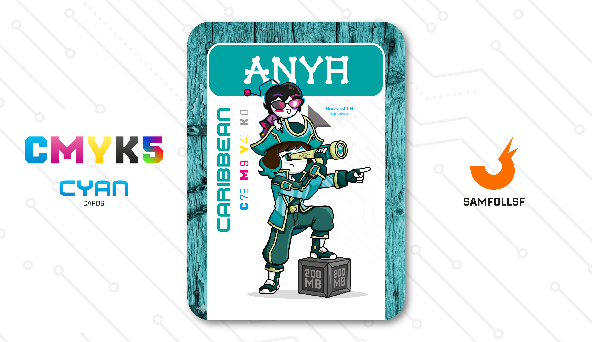

---
tags:
  - Snoctix.inc

...

# Anya

## Descrizione

Anya opera come spia per la [Snoctix.Inc](../Magenta/solisnoctix.md) con il compito di infiltrarsi nelle reti criminali rivali per scovare nuove reclute o asset preziosi da piratare, un concetto che nel Webverse assume la forma concreta di furto di file per appropriarsi della proprietà digitale altrui. 

### Equipaggiamento

Nelle sue spedizioni non è mai sola: al suo fianco c'è quella che a prima vista sembra una [Solisnoctix](../Magenta/solisnoctix.md) in miniatura, ma che in realtà è un esemplre di Snoctix.LLM Wireless, uno sguardo inedito alle AI nella lore CMYK5. Questa piccola pulce non si limita a supportare Anya elaborando dati e tracciando tutto ciò che vede, ma funge anche da terminale remoto: all'occorrenza, infatti, la vera [Solisnoctix](../Magenta/solisnoctix.md) può prenderne il possesso diretto e controllarla a distanza.

## Colore

Lo vedi e sembra di essere proprio lì. Un po' alle Bahamas, un po' a Cuba, un po' in Giamaica. Ma il mare è quello! La parola Caraibi deriva dalla pronuncia inglese del nome dei Caribe, uno dei gruppi indiano-americani dominante nella regione al momento del contatto con gli europei.

## Curiosità

- Sul suo cannocchiale (rigorosamente con zoom digitale) è presente il logo della [Snoctix.Inc](../Magenta/solisnoctix.md).
- La sua giacca è fatta di [Smeraldo](../Remix/crystal.md), gentilmente offerta da [Lele](../Ciano/lele.md).
- Anya ha registrato [SamFollSF](../Remix/samfollsf.md) nei database della [Snoctix.Inc](../Magenta/solisnoctix.md) già nel 2021, ma ai tempi era completamente inutile da depredare.
- Nonostante anche gli Agent e Manager siano delle AI (molto avanzate), gli LLM come li conosciamo e usiamo oggi esistono anche nel Webverse per questione di comodità.

# Volume VI: BE OKAY