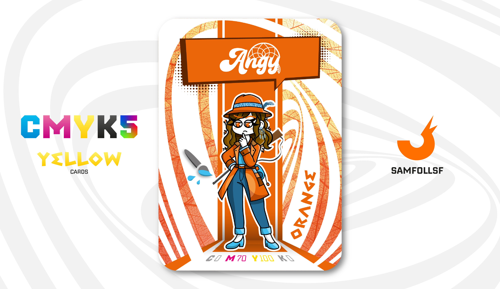

---
tags:
  - Web Intelligence

...

# Angy

## Descrizione

Da semplice impiegata negli uffici della Web Intelligence a vicedirigente del padiglione Ricercati e Dispersi, il percorso di Angy è stato molto lungo. Conosceva [SamFollSF](../Remix/samfollsf.md) da molto tempo e, nonostante le loro idee opposte sulla legalità – lui un criminale, lei un'investigatrice governativa – erano comunque amici stretti. Tuttavia, da quando [SamFollSF](../Remix/samfollsf.md) è sparito dai radar nel 2020, Angy ha formato una squadra per rintracciarlo, temendo che potesse mettersi in guai seri. Più volte ha dichiarato alla stampa: 'Smentisco le voci che ci vedono come amici. Egli rappresenta una seria minaccia per la sicurezza del Blocco 87 e potenzialmente anche per quella di altri ancora. Faremo del nostro meglio per catturarlo.'

## Colore

Come il giallo e il marrone, è un colore abbastanza controverso. Comunicando energia e vitalità, è applicato in svariati ambiti, eppure chissà perché si colloca sempre agli ultimi posti nelle classifiche dei colori preferiti (eccezion fatta per i bambini, che invece lo amano)

## Curiosità

- Ad Angy piace tantissimo leggere libri, soprattutto fantasy. Nel suo studio dove dovrebbe avere libri utili per il suo lavoro ci tiene quelli di Narrativa.
- Indossa come orecchino un Acchiappasogni.
- Come [Dx4vid](../Magenta/dx4vid.md) anch'ella ha un animale domestico, un Barboncino di nome Cloe.
- In qualità di vicedirigente gli è consentito di portare con sè armi da fuoco in giro per il [Surface Web](../Remix/deep.md).
- Angy è il Manager di Angela Amirata.

# Versione Mazzo 1.0