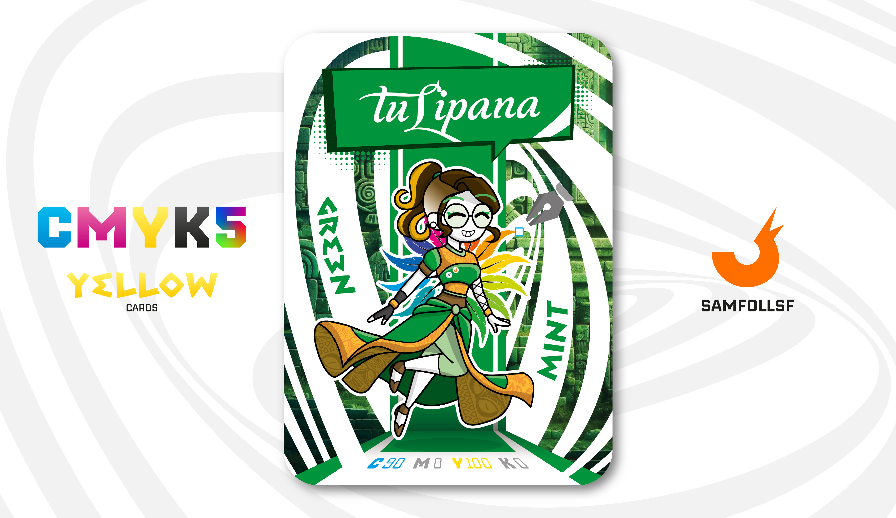

---
tags:
  - Gallery

...

# Tulipana

## Descrizione

La proprietaria della boutique "Il Tulipano", specializzata nella creazione di capi di abbigliamento e accessori fatti a mano ispirati allo stile azteco e ad altre antiche civiltà. È molto legata ad [Ales Dreams](../Magenta/alesdreams.md), anche se non è in alcun modo coinvolta nell'operazione [Red Winter](../Magenta/alesdreams.md).

Ciò che la sua amica non sa, però, è che anche lei, come [SamFollSF](../Remix/samfollsf.md), possiede uno [Strumento dei Fondatori](../Remix/tool.md). In particolare, si tratta di un paio di [Forbici Copypasta](../Remix/tool.md) che la consentono di utilizzare filamenti infiniti per le sue creazioni, anche se ogni filamento può essere usato una sola volta.

## Colore

Alcuni colori sono capaci di mettere subito di buonumore, e il Verde Menta è di certo tra questi. Sarà l'odore forte che sa d'estate, il ricordo della granita, magari la freschezza. Nei packaging di dentifrici, chewing gum o anche solo bevande, questo colore è d'obbligo per comunicare il gusto mentolato.

## Curiosità

- Lo stile della carta combina elementi delle civiltà antiche con influenze queer, evidenti nei dettagli come i capelli rasati sui lati, le calzamaglie che avvolgono le braccia e un cerchio di piume dai colori arcobaleno.
- Indossa 2 spille: Una con il logo di [SamFollSF](../Remix/samfollsf.md) e una con il logo di Trenitalia, che per fortuna non esiste nel WebVerse.
- Non usa un singolo nome, ne usa di diversi per potersi garantire un basso profilo, è doveroso citare nomi dal calibro di "Tortellini Viola". Anche il mitico [Assasseeeeno](../Ciano/assasseeeeno.md) usa diversi nomi.
- Tulipana Verde è il Manager di Delia Lo Turco.

# Versione Mazzo 1.0