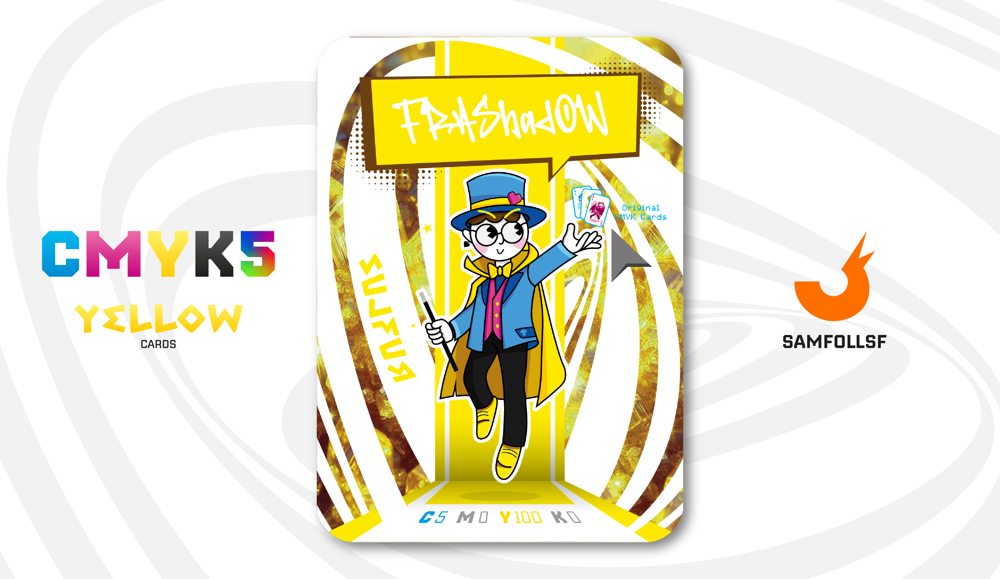

---
tags:
  - Dimensione Z

...

# Frashadow

## Descrizione

Mago di professione, Frashadow intrattiene spettacoli di magia in tutto il [Surface Web](../Remix/deep.md). Grazie a questo lavoro ha conosciuto persone di ogni tipo, anche boss mafiosi che organizzavano eventi privati.

Ma quindi, Frashadow è davvero in grado di fare magie inspiegabili? Beh, no. Mi dispiace, ma anche in un mondo completamente digitale, la magia non esiste. Il suo segreto, tuttavia, sta nella creazione dei suoi oggetti di scena, che realizza personalmente: li progetta e li stampa in 3D utilizzando PLA.

## Colore

Un giallo intenso e brillante con riflessi leggermente dorati, ispirato alla purezza e alla luminosità dei cristalli di Zolfo naturale. Evoca energia, vitalità e un tocco di misteriosa eleganza.

## Curiosità

- Selezione: Quello che fa fluttuare è il mazzo CMYK ma nella sua primissima versione che risale al 2022. Un mazzo di carte francesi che non ho mai reso pubblico.
- Anche il suo vestito è a tema CMYK con i relativi semi (Picche, Cuore, Fiore e Quadro).
- Nel tempo libero pratica Baske. Ha persino stampato un campo interno in PLA!
- Può vantare di avere una foto con l'Agent di LeBron James.
- Frashadow è l'Agent di Francesco Emanuele Altobelli.

# Versione Mazzo 1.0