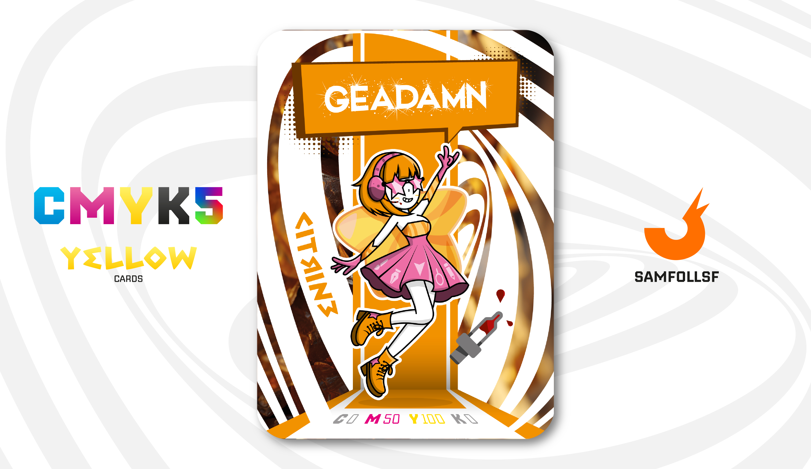

---
tags:
  - Pantera
...

# Geadamn

## Descrizione

Con Geadamn possiamo esplorare un tema interessante: nel Webverse, il concetto di celebrità è molto diverso da quello che conosciamo nel mondo reale. Facciamo un esempio per chiarire: sia nella vita reale che nel Web, The Weeknd è un personaggio famosissimo. Tuttavia la notorietà appartiene esclusivamente a lui, non al suo Agent.

In altre parole, The Weeknd è celebre, ma il suo Agent non lo è. Questo significa che i personaggi famosi nel Webverse non corrispondono necessariamente a quelli del mondo reale. Seguendo questa logica, persone che nella vita reale non sono celebri possono esserlo nel Webverse, e Geadamn è uno degli esempi più emblematici, essendo tra le figure pubbliche più influenti in questo mondo digitale.

E gli Agent delle celebrità reali? Non sono del tutto sconosciuti, ma la loro fama è molto inferiore, paragonabile a quella di un parente stretto di una persona famosa, con un'enorme differenza in termini di popolarità.

## Colore

Il colore Citrino è una tonalità luminosa e calda, a metà strada tra il giallo dorato e il giallo-verde. Ricorda la vivacità del sole al tramonto o la lucentezza di una gemma preziosa, evocando energia, positività e un tocco di eleganza naturale.

## Curiosità

- Nella carta viene introdotto uno strumento inedito per i Mazzi CMYK: il Contagocce. A differenza di quanto ci si potrebbe aspettare, non contiene inchiostro, ma vino, in riferimento all' hashtag #BEVICONGEMMA.
- Sulla sua gonna sono presenti tutti gli altri [Ttrumenti di Adobe](../Remix/adobe.md) che appaiono nei Mazzi.
- Nonostante la sua notorietà è rimasta fedele al suo gruppo di amici.
- Ama il Black Humor, e non lascia l'occasione ai suoi concerti di fare battute a sfondo razzista o sessiste.
- Geadamn è l'Agent di Gemma Damiano.

# Versione Mazzo 1.0