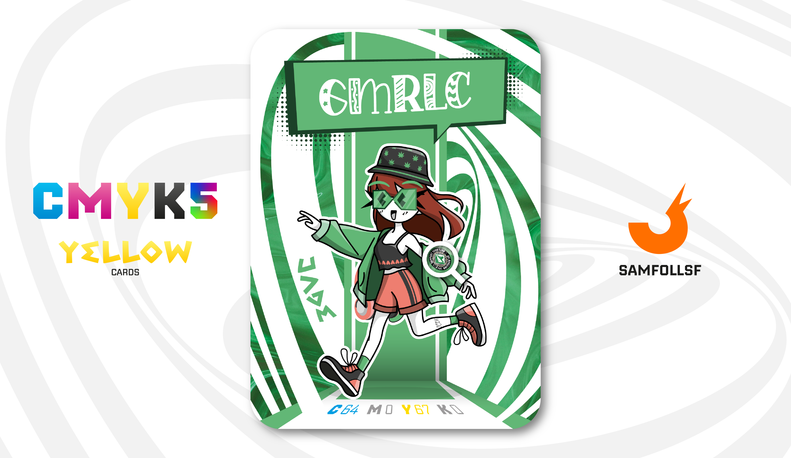

---
tags:
  - Gallery

...

# Gmrlc

## Descrizione

GMLRC è l'esempio perfetto di cittadino del [Surface Web](../Remix/deep.md). In questo mondo, non esiste un vero e proprio prezzo della vita. Gli Agent o Manager, infatti, non hanno bisogno di mangiare o dormire per sopravvivere, ma dipendono dall'elettricità che viene gratuitamente distrubuite nelle loro H.U.B. (Una sorta di Abitazione che si presenta come un monolocale). L'elettricità può essere autoprodotta dagli Agent attraverso l'assunzione di combustibile o tramite l'alimentazione mediante una presa di ricarica.

Gmrlc si ritroverà catapultata in una vicenda tragicomica che coinvolge nientemeno che la Web Intelligence, la controparte digitale dell'FBI. Trovandosi nel posto sbagliato al momento sbagliato, diventerà la vittima perfetta di un bizzarro reclutamento dell'agenzia alla ricerca di testimonianze e sondaggi.

## Colore

Un verde molto fresco, che prende il suo nome dalla gemma "Jade", una pietra che nell'antica cultura cinese veniva considerata portafortuna e capace di attirare denaro e amore.

## Curiosità

- Come per la sua controparte reale, anche lei crea delle storie social dove racconta della sua vita.
- Sulla sua giacca è presente lo stemma dell'Avellino.
- Il suo cappello ha una texture di erbe particolate, e comunque no, la Marijuana non esiste nel Web, tantomeno il fumo in generale. Esistono tuttavia alcool e droghe sintetiche, anche se quest'ultime sono consumate da pochissime persone che se lo possono permettere.
- Possiede un [Web Crystal](../Remix/crystal.md), ovvero un [Lapislazzulo](../Remix/crystal.md)

# Volume III: FREAK-LEADER