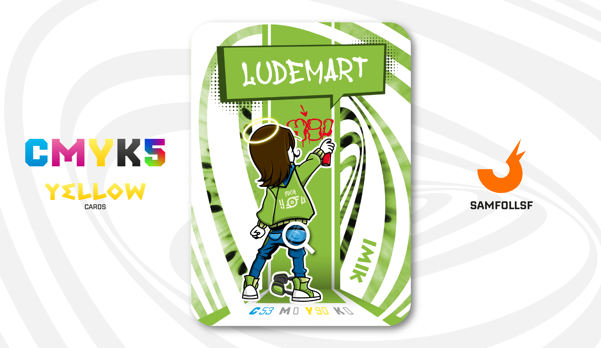

---
tags:
  - Street Art

...

# Ludemart

## Descrizione

Per fortuna degli abitanti del Web, in questo mondo la Circumvesuviana non esiste. I treni come mezzo di trasporto ci sono, ma funzionano in modo impeccabile. Ma cosa c’entra tutto questo con Ludemart? Ebbene, egli lavora come Street Artist decorando le fermate delle linee metropolitane del Web. Esatto: ogni fermata è arricchita da graffiti realizzati su spazi dedicati, e Ludemart viene pagato per le sue opere. Le stazioni senza graffiti sono considerate terribili, e i proprietari delle linee lo hanno capito. Chissà quando se ne accorgeranno anche EAV e Trenitalia?

## Colore

Il Kiwi è un colore forte e vitaminico, capace di regalare brio ovunque lo si usi. È molto apprezzato nell'abbigliamento sportivo e nei packaging che vogliono esprimere energia e vitalità.

## Curiosità

- Ha imbrattato lo studio di [SamFollSF](../Remix/samfollsf.md) con un graffito, ma siamo su Adobe Illustrator, quindi nulla è indelebile. Gli è andata male sto giro.
- Indossa una felpa con la scritta dietro la schiena Fuck YOU con il logo della Circumvesuviana, bellissima vorrei ricrearla anche nella realtà.
- Prima della sua carriera da writer pubblicamente riconosciuto, ha scontato un anno di prigione per aver partecipato a una rissa di massa tra tifoserie nel Web. Qui non si tifano le nostre squadre, pur conoscendone l’esistenza, ma si supportano club inediti di questa dimensione. Forse un giorno approfondirò l’argomento.
- Tiene nella tasca posteriore una scaglia d'[Oro](../Remix/metal.md) clonata con una [Forbice Copypasta](../Remix/tool.md) e quindi utilizzabile una sola volta nei casi di pericolo.
- Ha sulla testa un aureola. Quando sei il cosplayer di Gesù non può mancare questo dettaglio.
- Ludemart è l'Agent di Luigi De Martino.

# Versione Mazzo 1.0