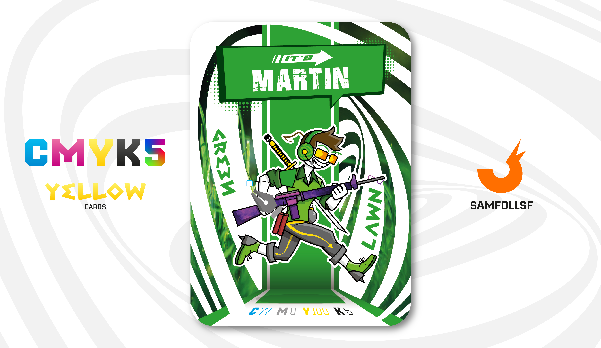

---
tags:
  - Batcancer / HotRide

...

# It's Martin

## Descrizione

Arruolato nell'esercito del [Surface Web](../Remix/deep.md) dal 2018, inizialmente insieme a [Il Panettone](../Magenta/ilpanettone.md), che però ha lasciato poco dopo, It's Martin non ha mai avuto molto da fare oltre a qualche simulazione periodica. La vera difesa di questa regione del Web è affidata a chi opera nelle profondità più remote, ma di questo parleremo più avanti. Morale della favola: It's Martin può passare intere giornate a giocare a Call of Duty... e viene pure pagato per farlo.

Non sto scherzando: Ad occuparsi dell'ordine pubblico ci pensano già i [Cavalieri di Rame](../Remix/metal.md) e i [Bruti Dorati](../Remix/metal.md), quindi gli Agent che lavorano per l'esercito non sono altro che una formalità.

## Colore

"Una tonalità che evoca i primi giorni di primavera, quando la natura si risveglia", ha detto la Executive Director del Pantone Color Institute parlando del Verde Prato, "green lawn" in inglese. Il colore Pantone 2017. Una sfumatura vivace di verde chiaro, rinfrescante e rivitalizzante.

## Curiosità

- Fa parte del gruppo "It's Web Company", una comunità di alleanza segreta fra gli Agent che utilizzano varchi clandestini per il [Deep Web](../Remix/deep.md). Anche [It's Terry](../Ciano/itsterry.md) ne fa parte.
- Possiede la fantomatica Katana di The Forest, mai trova da [SamFollSF](../Remix/samfollsf.md) e [Il Panettone](../Magenta/ilpanettone.md).
- Ha un'arma con la mimetica DM Ultra. Anche nel Web esistono le mimetiche per le armi dinamiche.
- Sulle sue cuffie in rilievo è presente il logo di Nvidia.
- It's Martin è l'Agent di Martin Costa.

# Versione Mazzo 1.0