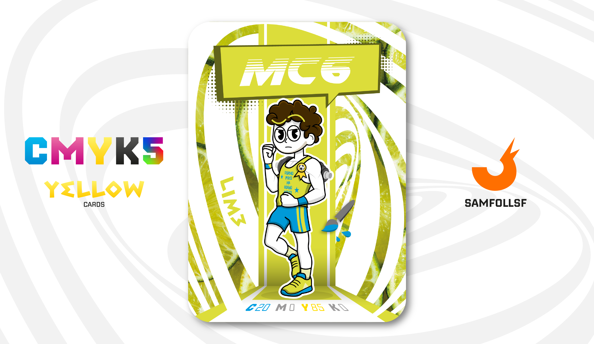

---
tags:
  - Loco

...

# MCS6

## Descrizione

Si può fare palestra nel Web Verse? Tecnicamente sì, e ora vi spiego come. Gli Agent non hanno una struttura corporea come la nostra, anzi, a dire il vero non ne hanno affatto: non sono organismi biologici. Tuttavia, esiste un modo per avere "muscoli" scolpiti, ed è legato alla ricerca sul proprio codice sorgente. Invece di sollevare pesi, nelle speciali palestre del WebVerse gli Agent devono analizzare il proprio codice sorgente – un po’ come il nostro DNA – per individuare, tra infinite stringhe di testo, il parametro che controlla la forma del corpo. Questo parametro, però, è nascosto in una posizione completamente casuale, rendendo la ricerca complessa e impegnativa.

C'è però un aspetto critico: questa analisi non si limita all'aspetto estetico. Permette potenzialmente agli Agent di modificare anche la loro forza, rendendoli una seria minaccia per la sicurezza del Web. Per questo motivo, tutte le sale studio sono costantemente monitorate da esperti in "Biologia Digitale" e sorvegliate da un numero significativo di [Guardie di Bronzo](../Remix/metal.md).

Tutto questo per dire che MC6 si allena proprio in una di queste palestre, dedicandosi alla sua crescita personale... o forse a qualcosa di più.

## Colore

Il Lime è un colore a metà fra il giallo e il chartreuse, chiamato così proprio per la sua somiglianza con il colore del frutto. La forte componente gialla determina il suo sottotono caldo, l'alta saturazione definisce la sua brillantezza.

## Curiosità

- Le palestre hanno sede nelle stesse del mondo reale, quindi sì la Loca Gym esiste anche nel [Surface Web](../Remix/deep.md) e MC6 la frequenta tre volte a settimana.
- Insieme a [SamFollSF](../Remix/samfollsf.md) detiene una lega di Fantacalcio, anche in questo caso le stesse squadre del mondo reale.(Citazioni doverose: Corto Musah, Pacchi FC e Scarsenal).
- Ha una medaglia sul petto dorata con il simbolo di un pallone da Calcio. (Ti devo gufare)
- Sulla sua canotta c'è scritto: "dormo poco ma sogno molto".
- MC6 è l'Agent di Michle Conte.

# Versione Mazzo 1.0