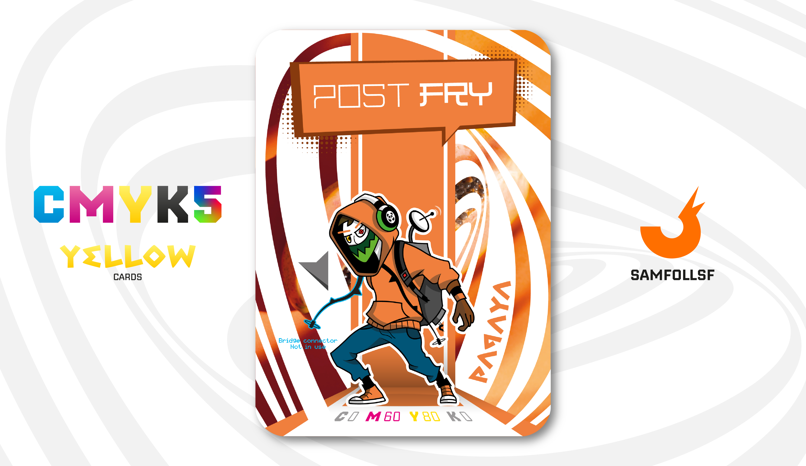

---
tags:
  - The Other Side

...

# Post-Fry

## Descrizione

Nel 2018, in tutto il [Surface Web](../Remix/deep.md), venne indetto un concorso da parte della società Global E-Gateway per un lavoro da dirigente degli scambi commerciali tra Cina e Italia, un ruolo molto ambito in rete. L'evento attirò così tante persone che si verificarono numerose risse, costringendo molti partecipanti a ricorrere a cure mediche. Il concorso non era altro che un semplicissimo esame teorico, che però è sfociato nel caos più assoluto.

Lo stesso giorno in cui venne annunciato il vincitore, Post-Fry, un'altra notizia sconvolse il Web: "A quanto pare, la Global E-Gateway è stata accusata di aver fatto sparire un candidato. Si tratta di Great Zodiak, un Agent di appena 16 anni, residente nel blocco 481, scomparso in circostanze misteriose all'interno del palazzo principale dove sarebbe dovuta avvenire la premiazione, ultima posizione nota."

Questa combinazione di eventi scatenò un acceso dibattito in tutta la rete.

## Colore

È proprio il colore vitaminico del frutto tropicale che evoca energia e voglia di evasione. Perfetto con i verdi, quelli della natura incontaminata da cui proviene.

## Curiosità

- Selezione: Il suo "Bridge Connector" gli permette di identificare la sua identità negli uffici a lavoro, connettendosi ai suoi computer.
- Questo lavoro gli ha permesso di avere un team tutto per sè per gestire questi tipi di acquisti e scambi in rete, e realtà come TEMU se ne saranno sicuramente accorte.
- Le sue cuffie hanno il logo dell'ormai defunto Pandabuy.
- Mentre si trova fuori dall'ufficio porta con sè uno zaino con l'occorrente per mettersi in contatto con gli investitori, per i casi più urgenti mentre non si trova in ufficio.
- Post-Fry è il Manager di Francesco Tella.

# Versione Mazzo 1.0