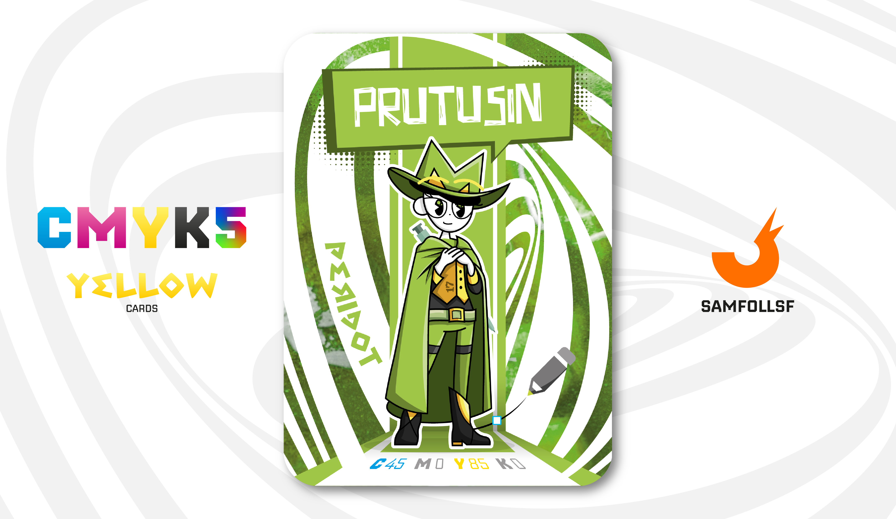

---
tags:
  - Batcancer / HotRide

...

# Prutusin

## Descrizione

Abbiamo visto come gli Agent e le persone reali differiscano in tutto, sia nel carattere che nei rapporti con gli altri. Ma cosa accade nel caso della fratellanza? Le controparti reali di Prutusin e [IlPanettone](../Magenta/ilpanettone.md) sono fratelli, ma come vedremo a breve, il loro legame nel Web è molto diverso da ciò che potremmo aspettarci.

Un esempio concreto di fratellanza nel Web sono [SamFollSF](../Remix/samfollsf.md) e [BlaseJewel51](../Remix/over.md): due account legati alla stessa persona reale e, per questo, fratelli a tutti gli effetti.

Tutto questo per arrivare a un punto importante: nel Web, i "fratelli" sono una rarità, molto più di quanto si possa immaginare. Ecco perché Prutusin e [IlPanettone](../Magenta/ilpanettone.md), per quanto legati nel mondo reale, nel Web potrebbero essere dei perfetti sconosciuti.

## Colore

Il peridoto è caratterizzato da un verde intenso e vivido, che può variare dal verde oliva al verde lime, spesso arricchito da sfumature dorate o giallastre. La sua luminosità calda e vibrante ricorda i toni freschi e rigeneranti della natura, conferendogli un aspetto unico e brillante che cattura la luce in modo straordinario.

## Curiosità

- Il suo design è a tutti gli effetti collegato a quello Cowboy de [IlPanettone](../Magenta/ilpanettone.md), infatti i loro cappelli hanno le iniziali delle loro controparti reali (M e N)
- Possiede, come è possibile vedere nella carta, una piccola S Pen Mystic Green prestata da [IlPanettone](../Magenta/ilpanettone.md), quest'ultimo ha infatti diviso le S Pen in due per permettere anche a lei di utilizzarla.
- Sul gilet è presente il numero 17. (Eh no, 17 non sta per "Blocco 17)
- È riuscita ad entrare nel Clan HotRide con qualche raccomandazione, ma almeno si rende utile portando il caffè ai sicari più importanti.
- Prutusin è l'Agent di Maria Di Colandrea.

# Versione Mazzo 1.0