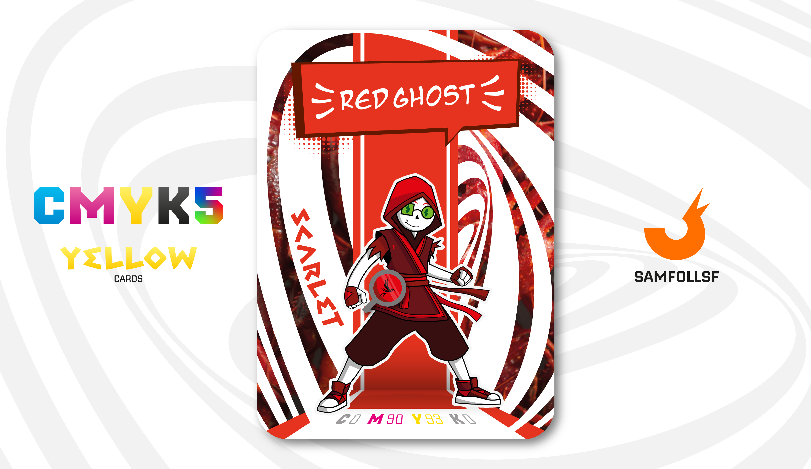

---
tags:
  - Batcancer / HotRide

...

# Red Ghost

## Descrizione

Un appassionato collezionista di trofei che simboleggiano i quattro metalli nobili del WebVerse: Rame, Argento, Oro e Platino. Tuttavia, questi trofei non sono composti interamente dai metalli che rappresentano. Ad esempio, il trofeo di platino, come gli altri, contiene solo un 10% di rame, mentre il resto è costituito da metalli meno pregiati. Quindi sì, purtroppo i trofei di Platino contengono lo 0% di questo metallo e così via.

Inizialmente, era a caccia di trofei insieme a [SamFollSF](../Remix/samfollsf.md), ma il loro rapporto si è incrinato quando quest’ultimo ha deciso di abbandonare il progetto, considerandolo una patetica perdita di tempo.

## Colore

Il nome deriva dal persiano "saqirlat", o dal latino astacus, "granchio". Ma nel nostro immaginario lo Scarlatto ha una connotazione forte: è scarlatta la lettera di Hawthorne, e Scarlett O'Hara è il nome inglese di Rossella, protagonista di Via col vento.

## Curiosità

- Ha una grande collezione di Manga, è il suo hobby preferito. Inoltre ha anche un deposito di 20Gb di soli meme e shitpost ma questi sono dettagli.
- Sul suo vestito è ricamata una lettera "F" in citazione ad Alphabet Lore di Mike Salcedo.
- Sulla borsetta ha sopra il simbolo del Dio Anubis della mitologia egiziana.
- La sua bocca è una R allungata.
- Red Ghost è l'Agent di Gaetano Cangiano.

# Versione Mazzo 1.0