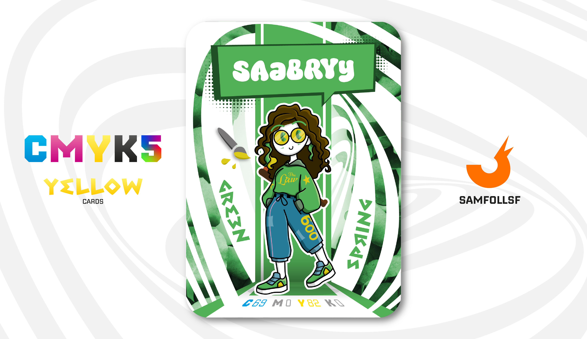

---
tags:
  - Fil di Ferro

...

# SAaBRYy

## Descrizione

Come descritto nella carta [Surface Web](../Remix/deep.md), i dati dei server sono archiviati in grandi cassettiere situate nei grattacieli sparsi per tutta la città. SAaBRYy si occupa della loro archiviazione e del successivo recupero dei singoli file, svolgendo di fatto il ruolo di custode di una di queste cassettiere. In particolare, il suo compito insieme ad altri Agent è ordinare quella relativa al sito web del governo italiano, con un’attenzione speciale alla pagina sui Principi Fondamentali.

## Colore

La prima volta che si è usata questa espressione per identificare questo colore è stata nel 1766. Effettivamente ci fa pensare alla natura che si risveglia e al verde del fogliame che si rinnova, più vivace e brillante che mai.

## Curiosità

- Ha ottenuto questo lavoro grazie all'iscrizione da parte della sua controparte reale alla facoltà di giurisprudenza, anche se è un evento più unico che raro ottenere una carica simile.
- Sul suo pantalone c'è la scritta "600", come la controparte "500" di [Shadow Èlite](../Magenta/shadowelite.md).
- Per esigenze lavorative ha dovuto imparare l'Inglese, Francese, Spagnolo e Ceco. L'apprensione di una lingua inedita per un Agent è istantanea, si importa letteralmente un nuovo linguaggio nella propria stringa di codice sorgente, ma è un'operazione tremendamente costosa.
- Indossa una felpa con la scritta "The Law".
- SAaBRYy è l'Agent di Sabrina Ciotola.

# Versione Mazzo 1.0