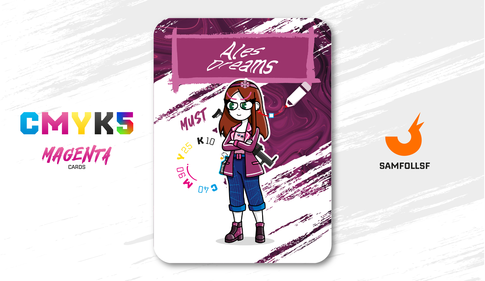

---
tags:
  - Red Winter

...

# Ales Dreams

## Descrizione

Ales Dreams è il presidente dell'Operazione Red Winter, un'iniziativa nata per monitorare l'uso e la diffusione degli [Strumenti dei Fondatori](../Remix/tool.md) ottenuti illegalmente nel [Surface Web](../Remix/deep.md). Questi potentissimi strumenti sono stati dichiarati illegali solo a partire dal 2020, salvo specifiche autorizzazioni governative. Questo ritardo normativo ha permesso una diffusione massiccia di questi strumenti, ma con l'introduzione di leggi così restrittive, si stima che ne rimanga attivo solo il 2%.

Ella è a conoscenza di molti sospettati, tra cui [SamFollSF](../Remix/samfollsf.md) e [OpsGiuly](../Nero/opsg.md), ma manca delle prove necessarie per ottenere un mandato di arresto globale. Se mai venissero catturati, la loro pena sarà stabilita dalla Digital Court. Con lei fanno parte dell'Operazione: [1udovìt](../Ciano/ludovit.md), [NotFleex](../Ciano/notfleex.md), [Chitty](../Magenta/chitty.md) e [Gabmiglior_](../Nero/gabmiglior.md).

## Colore

È il vino giovane, irrequieto, che sobbolle, che non è ancora pronto. Il Mosto (Must) è piuttosto torbido, ma associato al beauty svela tutto il suo fascino e risulta molto bello per diverse applicazioni: dagli smalti al rossetto, fino a un eyeliner più particolare.

## Curiosità

- Il presidente dispone dell'appoggio della Web Intelligence per le sue ricerche, si stima che entro il 2035 tutti gli Strumenti dei Fondatori saranno archiviati e successivamente distrutti, per evitare una fuga di risorse in futuro.
- Conosce perfettamente il Russo, d'altronde tutta l'operazione ha avuto inizio nei server Russi.
- Uno dei suoi orecchini è un fantasma di Pac-Man.
- Porta sempre con sè una molotov con la skin di una bottiglia di Vodka.
- Indossa due spille con due bandiere: una della Russia e l'altra dell'Estonia.
- Ales Dreams è l'Agent di Alessandra Piano.

# Versione Mazzo 1.0