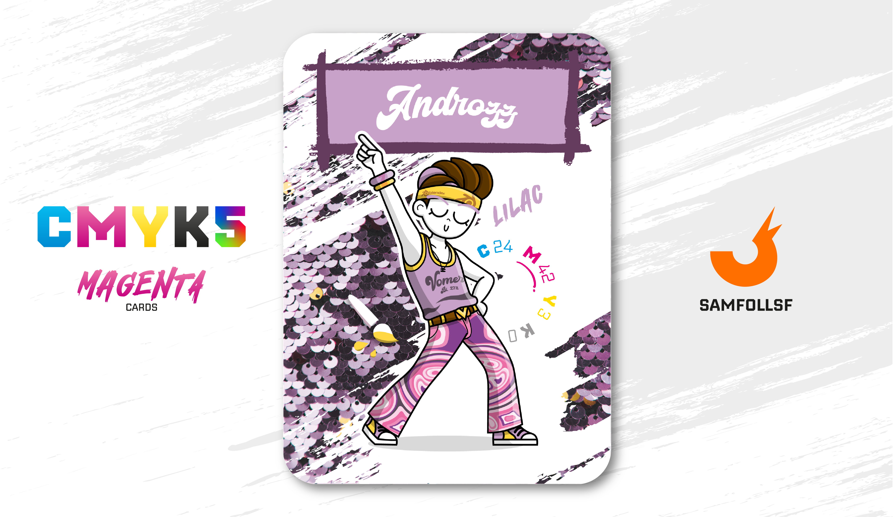

---
tags:
  - Dimensione Z

...

# Androzz

## Descrizione

Facciamo un tuffo negli anni ’70, anche se di quel decennio qui c’è ben poco. Androzz è un Agent molto abile nella modellazione 3D, utilizzando software come Blender, un mondo lontano dalle competenze di [SamFollSF](../Remix/samfollsf.md). Questa capacità lo rende non solo estremamente agile nei movimenti, grazie alla sua costante interazione con le tre dimensioni, ma anche ben attrezzato grazie al suo armamentario personalizzato.

Androzz è in grado di creare armi di qualsiasi tipo e forma, che poi rivende principalmente nel [Deep Web Nascosto](../Remix/deep.md). In questa regione del Web, reperire un’arma è molto più difficile rispetto al [Surface Web](../Remix/deep.md), e persino armi realizzate in PLA possono fare la differenza.

## Colore

Fiori fitti, vicini, profumo inconfondibile, il colore proviene dai fiori di lillà, originari dall'Estremo Oriente, i cui petali sono l'esempio perfetto della raffinatezza di questa cromia. Un fiore di lillà appare anche nel celebre Sogno di una notte di mezza estate di Shakespeare.

## Curiosità

- Ha un patrimonio monetario notevole, è in possesso di 4 ville sparse per il Surface Web, Automobili e persino una barca.
- Di anni '70 c'è solo lo stile della carta e del suo vestiario, ma nel mio cuore rimarrà sempre il "Ragazzo Anni '70".
- Indossa una fascia con sopra il logo di Blender.
- È misteriosamente riuscito a far partire Windows su un Mac. Non ha alcun senso ma è la cosa più scomoda e divertente di sempre.
- Sulla sua canotta è presente la scritta "Vomero" con annesso il blocco 272.
- Androzz è l'Agent di Andrea Varriale.

# Versione Mazzo 1.0