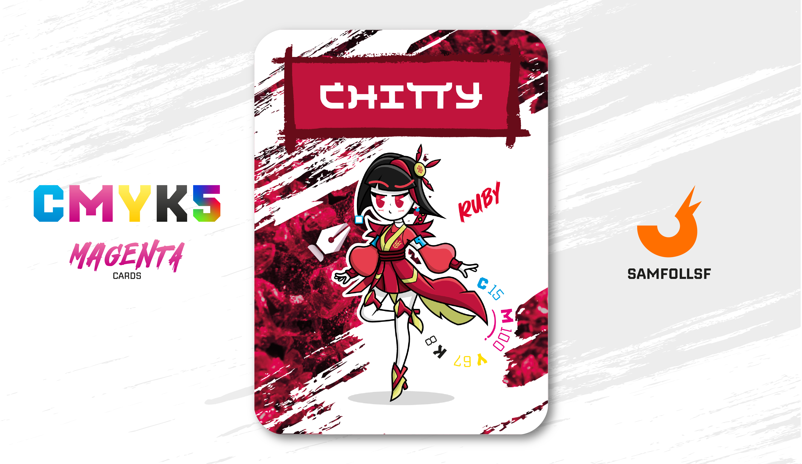

---
tags:
  - Red Winter

...

# Chitty

## Descrizione

Chitty è un’agente dell’Operazione [Red Winter](../Magenta/alesdreams.md), specializzata nell’individuazione delle [Bussole Booleane](../Remix/tool.md). Questo contesto ha trasformato radicalmente la sua personalità: da ragazza timida e con capacità di combattimento discutibili, oggi appare come una figura autorevole, determinata e glaciale, capace di uccidere senza esitazioni; tuttavia, mantiene un lato ottimista e gioioso, seppur in misura limitata.

Per l'Operazione [Red Winter](../Magenta/alesdreams.md) è una delle risorse più importanti, godendo di una carica più alta di tutti gli altri membri sul campo. Ha anche coinvolto [Notfleex](../Ciano/notfleex.md) in questa storia per aiutarla nei combattimenti, ma il presidente [Ales Dreams](../Magenta/alesdreams.md) lo trova dal primo giorno troppo emotivo ed impulsivo, e per iniziare gli ha dato una carica da ufficio.

### Equipaggiamento

Come riesce a rintracciare un oggetto così insidioso e difficile da contrastare? La risposta è semplice: anche lei possiede una [Bussola Booleana](../Remix/tool.md). Questo strumento le consente di neutralizzare le bussole di contrabbando e di rilevare attività sospette in una determinata zona. Chitty può segnalare la presenza di un Agent coinvolto in azioni illecite, consentendo a una squadra di supporto di intervenire per effettuare i necessari accertamenti.

## Colore

Il Rubino, in natura, è un corindone rosso, il cui nome deriva dal latino "rubens" (rosso). Un colore affascinante, che da sempre è stato al centro di leggende e miti. I greci chiamavano queste pietre "ántrax" (carbone vivo), poiché credevano che, esposte al calore, diventassero del colore dei carboni ardenti.

## Curiosità

- È una fan incallita di Hello Kitty, ha pure una foto insieme a lei.
- Anche se non è chiaro come, tra il suo guardaroba à spawnato una giacca della squadra di calcio Puteolana.
- Riesce a maneggiare armi in ECMAScript con molta eleganza, l'Operazione [Red Winter](../Magenta/alesdreams.md) ha concesso lei di portare in giro con sè una Katana anche quando non è in servizio.
- Odia essere ripresa, e non si farebbe scrupoli a tagliare in due eventuali fotocamere con la sua arma.

# Volume IV: RED WINTER