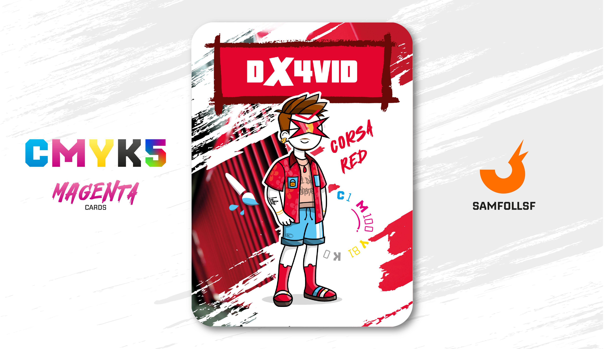

---
tags:
  - Mila Giri

...

# Dx4vid

## Descrizione

Dx4vid organizza eventi nelle regioni del [Surface Web](../Remix/deep.md) vicine ai grandi [Ristagni d'acqua](../Remix/frutiger.md), dove si trovano vere e proprie baite lungo le sponde. Lui stesso possiede una di queste baite, situata nel Blocco 14. Tuttavia, è raro che i partecipanti a queste feste decidano di tuffarsi in acqua: da un lato, perché l'acqua è verdognola e molto sporca; dall'altro, perché pochi Agent sanno nuotare. Dx4vid, peraltro, è tra i pochi che hanno questa abilità.

## Colore

Il nome "Corsa Red" arriva negli anni '30, quando la FIA, agli albori del campionato mondiale di Formula 1, impone di identificare la nazionalità delle varie squadre in base al colore. Le italiane diventano rosse.

## Curiosità

- Per gli spostamenti nel Web usa il suo favoloso Kymco Peoples 125, importato digitalmente qui.
- In realtà, come tutti, ha due occhi e non uno solo, come potrebbe sembrare a prima vista. I suoi particolari occhiali a forma di X, infatti, funzionano come un visore smart.
- Indossa una maglietta con la scritta  "Il Dio Ghane".
- Sulla camicia è presente un lucchetto con un simbolo di una videocamera sopra: "Davide Sbloccati!".
- A differenza del nostro mondo avere un Animale è estremamente raro dal momento che sono macchine al 100% Artificiali. Tuttavia Dx4vid ha scelto di acquistare uno di questi animali da compagnia, un gatto, e l'ha chiamato Lulù.
- Dx4vid è l'Agent di Davide Massa.

# Versione Mazzo 1.0