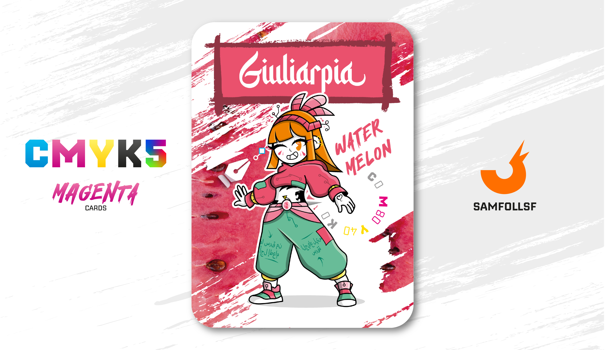

---
tags:
  - Pantera

...

# Giuliarpia

## Descrizione

Ormai abbiamo imparato i diversi ruoli che le carte del set "Pantera" ricoprono nella trama.

Ora tocca a Giuliarpia, una saccheggiatrice di metalli, per la precisione di [Oro](../Remix/metal.md). Oggetti così potenti non potevano non esser desiderati e ricercati da tutti nel Web. Come viene detto nella carta di [Shadow Elitè](../Magenta/shadowelite.md) i metalli non nobili vengono estratti in delle miniere, come si potrebbe facilmente intuire, ma quelli [nobili](../Remix/metal.md)...  vengono estratti anche loro in delle miniere, niente di speciale.

Ci sono però differenze sulla sicurezza e controllo di quest'ultime, passando per i più sofisticati mezzi di cybersicurezza nei vari siti di scavo, rigorosamente di proprietà del governo. Quello che i signorotti al potere non sanno è che Giuliarpia è un'esperta nelle operazioni furtive, oltre ad essere un'abile hacker, riuscendo a bypassare ogni sistema di riconoscimento del personale e rimandendo occulta ai [Cavalieri di Rame](../Remix/metal.md) che sorvegliano la zona.

## Colore

Effetto anni '70, mattonelle con le mele ai muri della cucina, e anche con le angurie. Rinfrescante alle pareti e a vederlo indosso. È uno dei rossi ideali della palette Summer... e non poteva essere altrimenti.

## Curiosità

- Giuliarpia non è solo una criminale, ella è anche un'abile piercer, anche se non è un lavoro per lei ma lo fà per passione.
- A volte, durante i suoi live, [Geadamn](../Giallo/geadamn.md) la invita sul palco per un saluto, ma non appena si accorge che Giuliarpia sa catturare meglio l’attenzione, si infuria e la fa subito scendere, tra le sue risate e quelle del pubblico.
- Durante la seconda storia del libro [PakoLapp](../Ciano/pakolapp.md) avrà un ruolo importante in una missione di saccheggio di metalli. La sua Spark non si potenzierà di certo da sola.
- Ad altezza bacino ha un grande piercing incastonato nel corpo. Uso proprio il termine "incastonato" perché all'occorrenza può essere sfilato e diventare un'enorme pugnale di 50cm.
- Il suo sito da saccheggiare preferito si trova nel blocco [136](../Nero/mevrie.md).
- Giuliarpia è l'Agent di Giulia Pia.

# Versione Mazzo 1.0.2