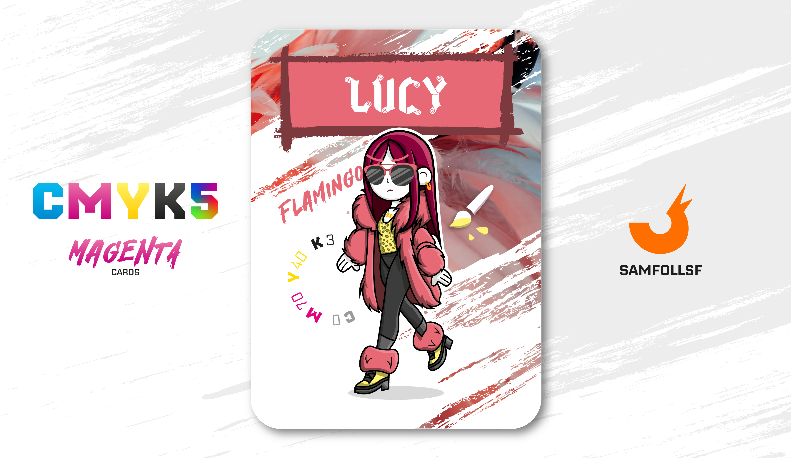

---
tags:
  - B&W

...

# Lucy

## Descrizione

Come [MC6](../Giallo/mc6.md), anche Lucy frequenta una palestra di ricerca, di proprietà della B&W. Prima di approfondire l'argomento, consiglio di leggere l'articolo dedicato a [MC6](../Giallo/mc6.md), in quanto ci sono altri dettagli interessanti da considerare. Lucy lavora in una di queste palestre nel [Surface Web](../Remix/deep.md) come supervisore. Il suo compito principale è controllare che eventuali Agent non effettuino ricerche di stringhe proibite nel loro codice sorgente.

Essendo supervisore, Lucy possiede un’armatura in bronzo, come richiesto dai protocolli di sicurezza per chi opera in quella posizione. In particolare, il suo ruolo consiste nel monitorare le attività di Agent più giovani che decidono di partecipare a queste ricerche. Sebbene non sia mai piacevole, il suo compito prevede anche l’uso della forza per punire gli Agent che infrangono le regole, come stabilito dal governo e dai protocolli.

Tuttavia, Lucy si chiede se esista un modo meno brutale per far rispettare le regole, evitando la violenza e adottando metodi più umani e comprensivi.

## Colore

Perché i fenicotteri hanno quel colore rosa così particolare e semplicemente fantastico? Lasciate stare il DNA! La verità è perché sono ghiotti del gamberetto rosa Artemia salina, da cui ottengono i carotenoidi, pigmenti che conferiscono alle loro penne il caratteristico colore.

## Curiosità

- Prende la metro così spesso che è ormai amica dei controllori, e non paga mai il biglietto.
- Il suo orecchino ha la forma di una punta di danza.
- Oltre a frequentare le Palestre di ricerca per lavoro, ogni tanto conduce anche delle ricerche sul proprio codice sorgente.- Indossa una collana con il logo EAV forgiato in [Oro](../Remix/metal.md).
- Lucy è l'Agent di Lucia Marrandino. 

# Versione Mazzo 1.0