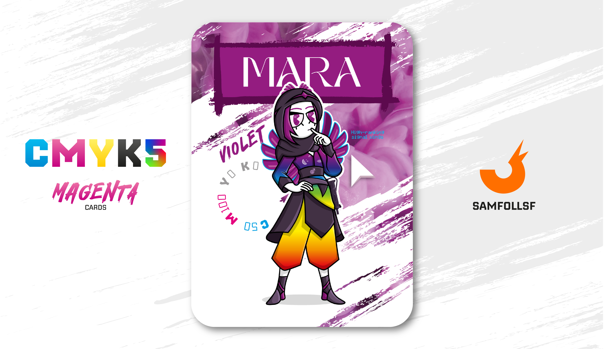

---
tags:
  - Gallery

...

# Mara

## Descrizione

Questo articolo su Mara è cruciale, ci permette di entrare in dinamiche mai dette fin'ora del WebVerse.

Trattiamo il tema dell'identità di genere di un'Agent, la quale non deve necessariamente combaciare con quella della controparte reale. Per farvi un esempio, [SamFollSF](../Remix/samfollsf.md) sarebbe potuto benissimo essere una ragazza o [GMRLC](../Giallo/gmlrc.md) un ragazzo. Nella versione 1.0.0 del mazzo ho preferito per convenzione di non scambiare le identità di genere, ma questo è il caso in cui questa cosa accade e sì, Mara è un maschio, non una femmina, nonostante la sua controparte reale lo sia. Naturalmente nel Web ci sono molteplici identità di genere, e qua sgancio una chicca importante di costume, [SamFollSF](../Remix/samfollsf.md) è un non-binario, quindi non è un maschio. Potrei farvi molti esempi ma mi limiterò qui.

Ma torniamo a Mara: è uno scrittore di codici che lavora su terminali simili a quelli presenti nelle [Palestre di ricerca](../Giallo/mc6.md). La grande differenza, però, è che il suo terminale si trova in un laboratorio privato non sorvegliato da nessuno, dove non si sperimentano sui corpi degli Agent o Manager, bensì gli oggetti e di conseguenza "armonizzandoli", una pratica assolutamente vietata nelle palestre tradizionali.
Un esempio? La [Chiave Quadridimensionale](../Remix/tool.md), che anziché aprire portali li potrebbe chiudere, creando così una Chiave Quadridimensionale Armonizzata Negativa. Come rivelerò nel libro, [SamFollSF](../Remix/samfollsf.md) farà ricorso a Mara e al suo laboratorio per armonizzare alcuni dei suoi strumenti, tra cui le [Forbici Copypasta](../Remix/tool.md).

## Colore

A metà tra rosso e blu, nei rituali religiosi del Medioevo era considerato un sotto-nero ("subniger" in latino) e tuttora è il colore della Quaresima. Jung lo definì "il colore tra l'umano e il divino, l'unione di due nature", e ancora oggi è il colore dell'anima, del fascino e del mistero.

## Curiosità

- Ricopre un'importante carica nell'organizzazione di eventi a carattere attivista e non solo nel sito Web dell'Accademia di Belle Arti di Napoli, tra cui l'introduzione alla seconda storia del libro delle carte.
- Porta con sé un Uzi che però non ha mai usato. (In verità non ha idea di come funzioni).
- Sul suo vestito è presente il disegno di un'Anguria.
- Inoltre è presente un simbolo molto particolare, ricorda quello generalmente usato per le manifestazioni femministe, ma invece del simbolo femminile è presente quello maschile. Non mi dilungherò su questo aspetto, lo lascierò al libro.
- Mara è l'Agent di Scilla Di Pietro.

# Versione Mazzo 1.0.2