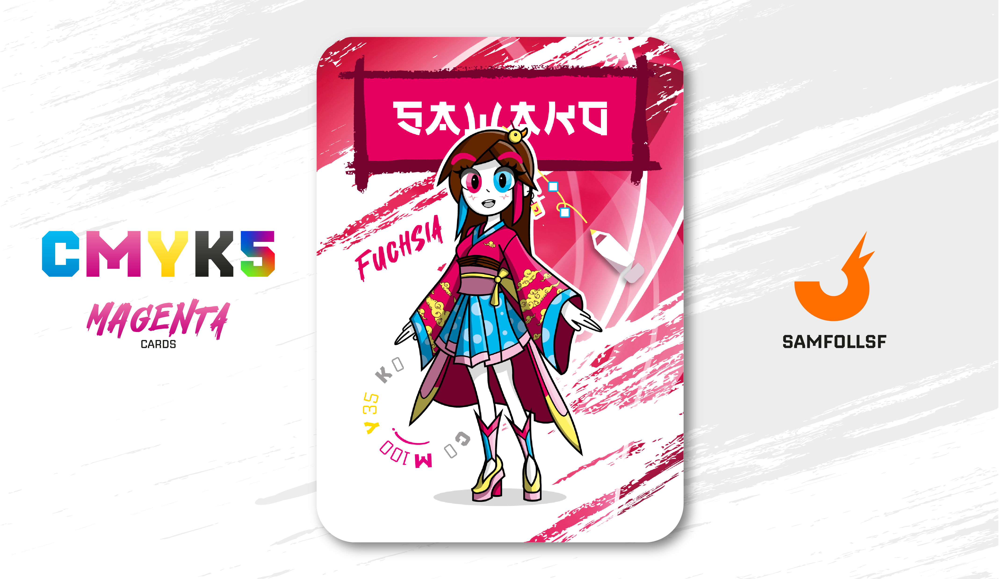

---
tags:
  - DeadLocked

...

# Sawako

## Descrizione

Sawako, dal rifacimento alla cultura giapponese, è sulle tracce di suo cugino [BlaseJewel51](../Remix/over.md) da ormai svariati anni, scomparso in circostanze misteriose nel 2015, a seguito della sua evasione dalla prigione del blocco 742, il [DeadLocked](../Remix/sa742sa.md). Ella sà che in questa faccenda centra [SamFollSF](../Remix/samfollsf.md), in quanto anche quest'ultimo evadette con lui. Sawako lavora per [Sa742Sa](../Remix/sa742sa.md) in qualità di spia e investigatrice per reintracciare gli evasori dal suo carcere. Attualmente il suo obiettivo è riuscire a mettersi in contatto con [SamFollSF](../Remix/samfollsf.md) per saperne di più su questa faccenda.

## Colore

O lo ami o lo odi: il fucsia non conosce mezze misure. Prende il suo nome dalla pianta Fuchsia, un arbusto che cresce nelle zone montane dell'America centro-meridionale. Allegro e frizzante, deciso e ipnotico, non è un colore per tutti. Sicuramente non per i timidi.

## Curiosità

- Sawako non ha due occhi di colore diverso, ma sono solo delle lentinte. I vero colore dei suoi occhi è il marrone.
- Con [BlaseJewel51](../Remix/over.md) si divertiva a giocare con lui al Nintendo prima che diventasse un criminale senza scrupoli, nel lontano 2012.
- Lo sfondo della carta si rifà al [Frutiger Aero](../Remix/frutiger.md).
- Sawako parla perfettamente Inglese, Giapponese, Francese e Russo.
- Ha sulla sua testa una piccola paperella, ovvero il suo avatar su Playstation Network.
- Sawako è il Manager di Tiziana Follera.

# Versione Mazzo 1.0