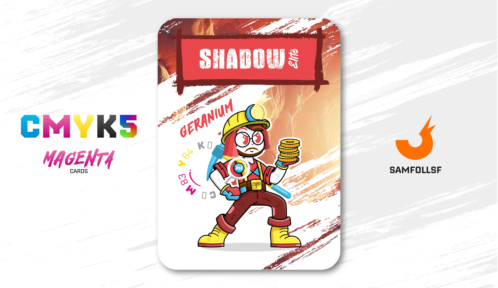

---
tags:
  - Fil di Ferro

...

# Shadow Èlite

## Descrizione

Il lavoro di Shadow Èlite consiste nell'estrarre dalle miniere i metalli che compongono le banconote e le monete del Web: Ferro, Alluminio, Mercurio e Titanio. Il valore della moneta aumenta progressivamente dal Ferro al Titanio, ma, a differenza dei [Metalli Nobili](../Remix/metal.md), questi non conferiscono poteri particolari; sono semplicemente oggetti di valore economico. Per fare un metro di paragone potremmo dire che:

- Una moneta di Ferro: 5$
- Una moneta di Alluminio: 15$
- Una banconota di Mercurio: 50$
- Una banconota di Titanio: 150$

In futuro questi metalli avranno le loro carte dedicate, magari nella versione del mazzo 1.1.

## Colore

Rosa vivace con una punta di rosso leggermente aranciato, il Geranio è un colore caldo e allegro, che ritroviamo nella palette Spring, sia per il beauty che per abiti e accessori.

## Curiosità

- Per l'estrazione mineraria utilizza un piccone lavorato in [Diamante](../Remix/crystal.md), un cristallo molto robusto adatto a lavori così usuranti. (Carta Diamante in arrivo con il Mazzo 1.1)
- Indossa una spilla con le iniziali "RH".
- Sulle bretelle appare la scritta "500", come la controparte "600" di [SAaBRYy](../Giallo/sabry.md).
- In passato ha lavorato in un centro scommesse insieme a [Pulak](../Nero/pulak.md), frequentato solitamente da [SamFollSF](../Remix/samfollsf.md).
- Shadow Èlite è l'Agent di Cristian Di Fraia.

# Versione Mazzo 1.0