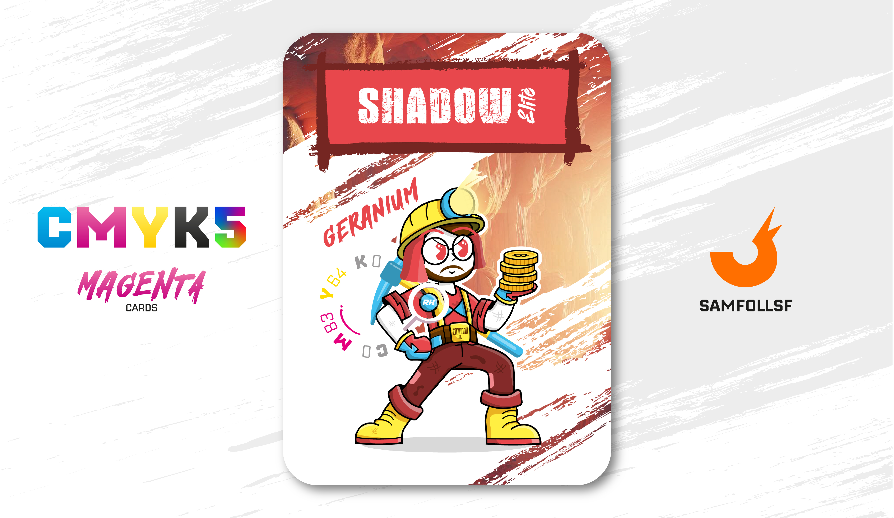

---
tags:
  - Fil di Ferro

...

# Shadow Èlite

## Descrizione

Il lavoro di Shadow Èlite consiste nell'estrarre dalle miniere i metalli comuni del Web: Ferro, Alluminio, Mercurio e Titanio. A differenza dei [Metalli Nobili](../Remix/metal.md), questi non conferiscono poteri di uguale potere distruttivo, ma possono arrivarci e come nell'utilizzo difensivo. Lastre di Titanio possono completamente annullare il potere del [Platino](../Remix/metal.md), ovviamente a patto di sapersi difendere da uno dei minerali più potenti del WebVerse. Il Titanio richiede un'abilità in combattimento eccellente, nervi d'acciaio e sangue freddo per riuscire a difendersi egregiamente. Tuttavia quando il [Platino](../Remix/metal.md) raggiunge la purezza prossima all'80% allora anche quest'ultimo metallo deve inginocchiarsi, solo il [Diamante Rosa](../Remix/crystal.md) può fronteggiarlo.

In particolar modo:
- LAlluminio neutralizza egregiamente il [Rame](../Remix/metal.md).
- Il Ferro neutralizza egregiamente l'[Argento](../Remix/metal.md).
- Il Mercurio neutralizza egregiamente l'[Oro](../Remix/metal.md).

## Colore

Rosa vivace con una punta di rosso leggermente aranciato, il Geranio è un colore caldo e allegro, che ritroviamo nella palette Spring, sia per il beauty che per abiti e accessori.

## Curiosità

- Per l'estrazione mineraria utilizza un piccone lavorato in [Diamante](../Remix/crystal.md), il cristallo più potente del WebVerse.
- Indossa una spilla con le iniziali "RH".
- Sulle bretelle appare la scritta "500", come la controparte "600" di [SAaBRYy](../Giallo/sabry.md).
- In passato ha lavorato in un centro scommesse insieme a [Pulak](../Nero/pulak.md), frequentato solitamente da [SamFollSF](../Remix/samfollsf.md).

# Volume I: HOT RIDE