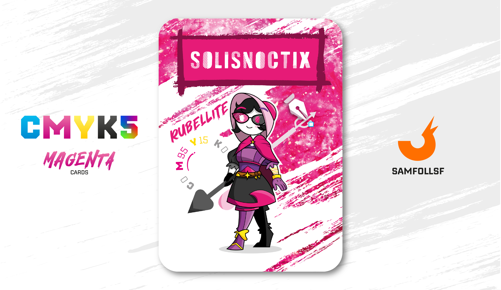

---
tags:
  - Snoctix.inc

...

# Solisnoctix

## Descrizione

Ella è la fondatrice e proprietaria della Snoctix.inc, una corporazione detentrice dei business di [Brioch33](santin.md), [Lele](../Ciano/lele.md) e [PickMeGiuls](../Ciano/pistilli.md). La prima lavora con Giuls nella raccolta e successiva rivendita di dati sensibili violando le norme di sicurezza del [Deep Web Esposto](../Remix/deep.md). Lele invece dirige siti di scavo alla ricerca di [Web Crystals](../Remix/crystal.md), un ordine subordinato a quello dei [Metalli](../Remix/metal.md) che permette di ottenere vari benefici. Meglio non scherzarci troppo, Solisnoctix è una vera potenza nel [Surface Web](../Remix/deep.md), stata soggetta di molte inchieste da parte del Governo senza però mai sfociare in niente di rilevante; quando hai il denaro puoi comprare anche la verità.

## Colore

Il Rubellite è un colore vivace ma molto delicato, che ricorda il candore dei fiori: è perfetto nella versione monocromatica, abbinato a tessuti impalpabili come lo chiffon , ma anche a quelli più corposi come il velluto.

## Curiosità

- Solisnoctix non è la madre di nessuno, nel Web non si possono avere figli e l'unico modo per far nascere un nuovo Agent è la creazione di un nuovo Account da parte di un essere umano.
- È un'abile disegnatrice, anche se in questo mondo digitale non esiste il disegno come lo indendiamo noi su carta, ma solo sui programmi di disegno digitale come Photoshop.
- Ha nativamente due occhi di colori diversi: Bianco e Magenta.
- Tiene sempre con sè la sua arma, una punta di una Penna non-capacitiva di Apple che funge anche da hub.
- Solinsoctix è il Manager di Gabriella Perrucci.

# Versione Mazzo 1.0