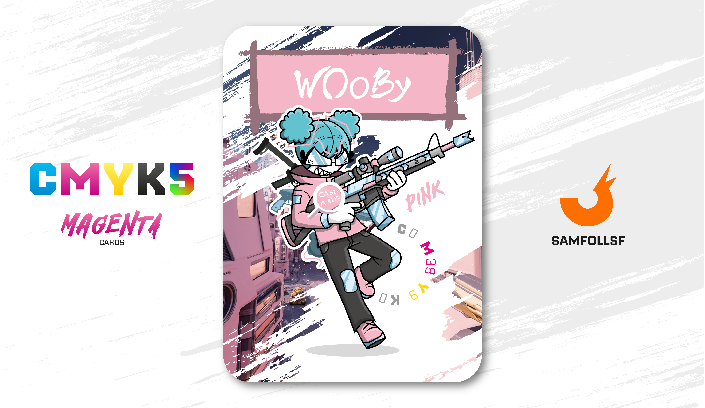

---
tags:
  - Frutiger Age

...

# Wooby

## Descrizione

Non c'è confronto che possa reggere raga, nemmeno esseri potentissimi come [Sa742sa](../Remix/sa742sa.md) o [Kyle](../Remix/metal.md). Wooby, nel mazzo CMYK5 aggiornato alla versione 1.0, è il personaggio più potente di tutti, con una presenza del 68% di [Platino](../Remix/metal.md) per massa corporea. Per avere un metro di paragone, per il Governo del Web, essere in possesso del 20% di Platino nel corpo non solo è illegale e punito con la pena di morte, ma supera anche gli standard di sicurezza per la salute degli Agent.

Le grandi dosi di [Platino](../Remix/metal.md) possono compromettere seriamente il funzionamento del corpo degli Agent, come se fossero radiazioni per il corpo umano. Tuttavia, test non ufficiali indicano che i veri effetti catastrofici si manifestano quando il livello supera il 70%, e che quelli più lievi bisogna superare il 40%.

Ovviamente Wooby non è l’essere più potente del Web, ma è sul filo del rasoio; la sua vita è in serio pericolo a causa della quantità spropositata di [Platino](../Remix/metal.md) che porta con sé, ma è un rischio calcolato. Wooby vuole essere temuta da tutti, e per questo è disposto a tutto.

E non mi sbilancio nemmeno a citare [SamFollSF](../Remix/samfollsf.md): davvero, non c'è storia. Nemmeno diecimila Sam potrebbero fermarla.

## Colore

Nella nostra tradizione, il rosa è associato alle bambine e al femminile in generale, ma fino al 1800 era totalmente adeguato a un uomo. Ve la ricordate la scena del romanzo di Fitzgerald, quando Gatsby si presenta a un pranzo indossando un abito gessato rosa?

## Curiosità

- Nel tempo libero realizza musica, anche se molti ricollegano a lei il suo canale di Meme [Wooby Su Youtube](https://youtube.com/@woobyy?si=jZlcarKuP-C4F_aU)
- I suoi capelli ricordano vagamente quelli di Hatsune Miku.
- Il Fucile che impugna è al 60% realizzato in Platino, praticamente un solo proiettile riesce a perforare 10 corazze d'[Oro](../Remix/metal.md) con un numero 2 sopra, l'eterno secondo. Inoltre il suo armamentario prevede anche altri due fucili sulla schiena.
- Sul suo vestito c'è la frase "Ca sta a man". (Chiedo Scusa)
- Wooby è l'Agent di una mia cara amica.

# Versione Mazzo 1.0