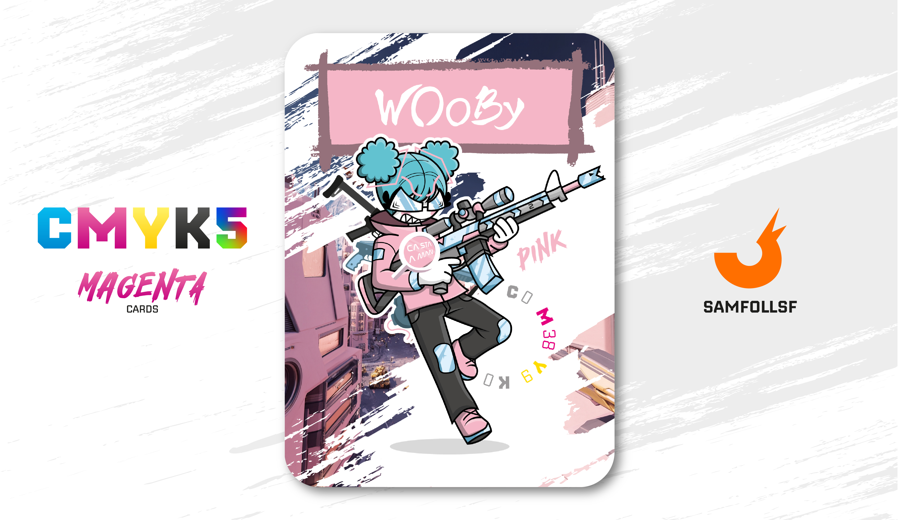

---
tags:
  - Frutiger Age

...

# Wooby

## Descrizione

Non c'è confronto che possa reggere, nemmeno esseri potentissimi come [Sa742sa](../Remix/sa742sa.md) o [Kyle](../Remix/metal.md). Wooby è uno dei personaggi più potenti di tutti, con una purezza del suo [Platino](../Remix/metal.md) che si aggira attorno al 75%. Per avere un metro di paragone, per il Governo del Web, essere in possesso del 20% di Platino nel corpo non solo è illegale e punito con severissime pene, ma supera anche gli standard di sicurezza per la salute degli Agent e Manager.

La purezza del [Platino](../Remix/metal.md) può compromettere seriamente il funzionamento del corpo degli Agent, come se fossero radiazioni per il corpo umano. Tuttavia, test non ufficiali indicano che i veri effetti catastrofici si manifestano quando il livello di purezza supera il 78%, e che quelli più lievi bisogna superare il 40%.

Ovviamente Wooby non è l’essere più potente del Web, ma rimane comuqnue sul filo del rasoio; la sua vita è in serio pericolo a causa della quantità spropositata di [Platino](../Remix/metal.md) che porta con sé, ma è un rischio calcolato. Wooby vuole essere temuta da tutti, e per questo è disposta a tutto.

E non mi sbilancio nemmeno a citare [SamFollSF](../Remix/samfollsf.md): davvero, non c'è storia. Nemmeno diecimila Sam potrebbero fermarla.

### Equipaggiamento

Il Fucile che impugna è realizzato con [Platino](../Remix/metal.md) al 60% di purezza, un solo proiettile riesce a perforare 10 corazze d'[Oro](../Remix/metal.md), con un numero 2 sopra: l'eterno secondo. Inoltre il suo armamentario prevede anche altri due fucili sulla schiena.

## Colore

Nella nostra tradizione, il rosa è associato alle bambine e al femminile in generale, ma fino al 1800 era totalmente adeguato a un uomo. Ve la ricordate la scena del romanzo di Fitzgerald, quando Gatsby si presenta a un pranzo indossando un abito gessato rosa?

## Curiosità

- Nel tempo libero realizza musica, anche se molti ricollegano a lei il suo canale di Meme [Wooby Su Youtube](https://youtube.com/@woobyy?si=jZlcarKuP-C4F_aU)
- I suoi capelli ricordano vagamente quelli di Hatsune Miku.
- Sul suo vestito c'è la frase "Ca sta a man".

# Volume VII: THE OTHER SIDE