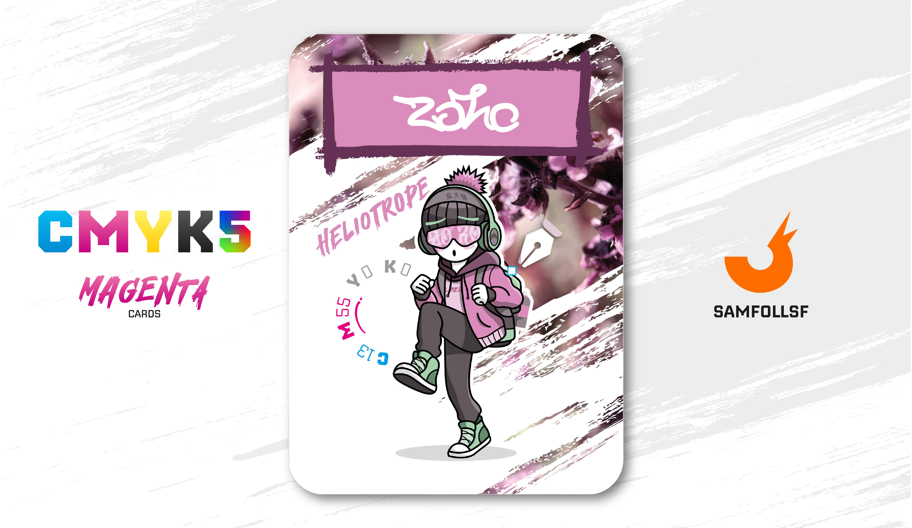

---
tags:
  - Street Art

...

# Zoro

## Descrizione

Un writer di graffiti nel [Surface Web](../Remix/deep.md). Come nel nostro mondo, anche qui esiste il concetto di vandalismo su luoghi pubblici, considerato a tutti gli effetti un reato. I motivi che spingono molti writer e crew a intraprendere questa attività sono spesso di natura sociale: un modo di protestare e far sentire la propria voce, muovendosi nell'ombra.

Solo i writer più esperti osano spingersi nel [Deep Web](../Remix/deep.md) per espandere questa forma d’arte, quasi sempre accedendo tramite entrate clandestine.

## Colore

Via di mezzo fra il porpora e il rosa, anche qui il nome del tono deriva dall'Heliotropium, un fiore originario del Perù. È un colore molto luminoso e secondo alcuni simboleggia la certezza.

## Curiosità

- Pratica diversi sport, come il pugilato. Frequenta anche le Palestre di Ricerca. Per maggiori informazioni consulta la carta di [MC6](../Giallo/mc6.md)
- Sul suo capello c'è la dicitura 3 X 10.
- All'interno delle lenti degli occhiali c'è la scritta ZO - RO.
- Per spostarsi nel Web usa solitamente la sua bici. Esatto, esistono anche le bici nel Web, e sono anche piuttosto comode, non sono soggette a restrizioni particolati.
- Zoro è l'Agent di Giuseppe Pisanti.

# Versione Mazzo 1.0