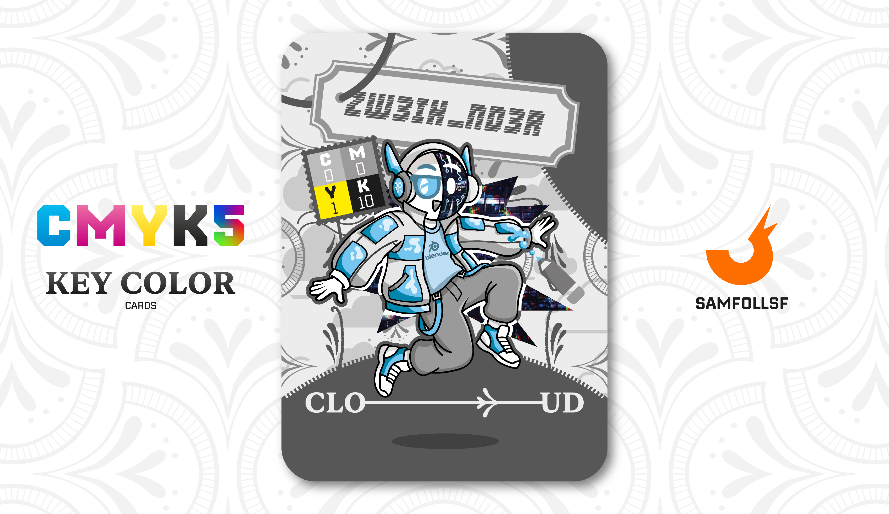

---
tags:
  - Dimensione Z

...

# Zw3ih_nd3r

## Descrizione

Zw3ih_nd3r condivide con [Arion64](../Giallo/arion64.md) un tratto distintivo: una protesi facciale. Nel suo caso, però, l'origine della mutilazione è decisamente più intuitiva: un violento danno da caduta. Non tutti i mali vengono per nuocere, Zw3ih_nd3r ha trasformato quell'incidente nell'ispirazione per due creazioni.

​La prima è la sua giacca, realizzata in un peculiare materiale morbido e viscoso. Questa composizione gli permette di lanciarsi da grandi altezze e rimbalzare al suolo senza riportare il minimo graffio, a un'unica condizione: l'impatto deve avvenire rigorosamente di busto.

​La seconda è il "The Broken Eye". Non si tratta solo di un occhio meccanico superiore alla vista default, ma di un sistema integrato da un'IA che gli consente di vedere la realtà del Webverse attraverso filtri unici. Grazie a lenti intercambiabili via software, può passare dalla visione termica a quella notturna, fino alla percezione delle vibrazioni.

## Colore

Il colore Nuvola è una sfumatura eterea e ovattata, sospesa tra il bianco puro e un grigio impalpabile. Evoca leggerezza, silenzio e una morbidezza diffusa che riposa lo sguardo.

## Curiosità
- È l'inventore della protesi di [Arion64](../Giallo/arion64.md), solo che quella lì esiste solo per tenere l'Agent ancora in vita senza poteri particolari.
- "The Broken Eye" è una chiara citazione a "The Broken Art".
- Sulle sue cuffie la destra è segnata con 2 R.
- Indossa una maglietta brandizzata Blender.

# Volume V: COUNTER-CULTURE MOTOR SHOW