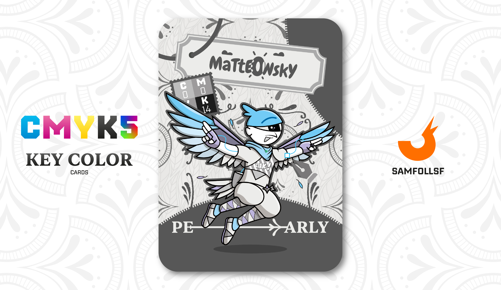

---
tags:
  - Pantera

...

# Matteowsky

## Descrizione

È un aereo? È un razzo? No è un ucc... ok, non ha mai fatto ridere, scusatemi. Matteowsky è un personaggio molto interessante, poiché ha intrapreso un percorso di crescita interiore, iniziato con la sua frequentazione del [Tempio Platino](../Remix/metal.md) per apprendere l'arte della platinoterapia. Piccolissime dosi di questo metallo riescono a conferire benefici spirituali, agendo direttamente nella scheda madre dell'Agent che decide di intraprendere questa strada.

Ha inziato la platinoterapia da 4 anni. Questo non lo ha però allontanato dalla società: Matteowsky mantiene una cerchia di amici stretti e condivide la sua vita con la sua ragazza, [Lele](../Ciano/lele.md).

## Colore

Il colore più simile alla perla, una delle gemme ritenute più preziose sin dall'antichità. Giulio Cesare, generale romano, amante delle perle, fece approvare una legge nel I secolo a. C. che impediva ai ceti inferiori di indossarle.

## Curiosità

- È abilissimo nei combattimenti sia terrestri che aerei, grazie alle sue ali che gli permettono oltre di planare anche di innalzarsi velocemente dal suolo.
- Il suo vestito ad altezza petto ha una scritta "Ciak", dal momento che Matteowsky è appassionato di Cinema.
- Indossa un casco che fa confluire i suoi occhi in uno solo, nella carta sembra essere un ciclope ma in realtà ha due occhi come tutti.
- Matteowsky è l'Agent di Matteo Uccello.

# Versione Mazzo 1.0