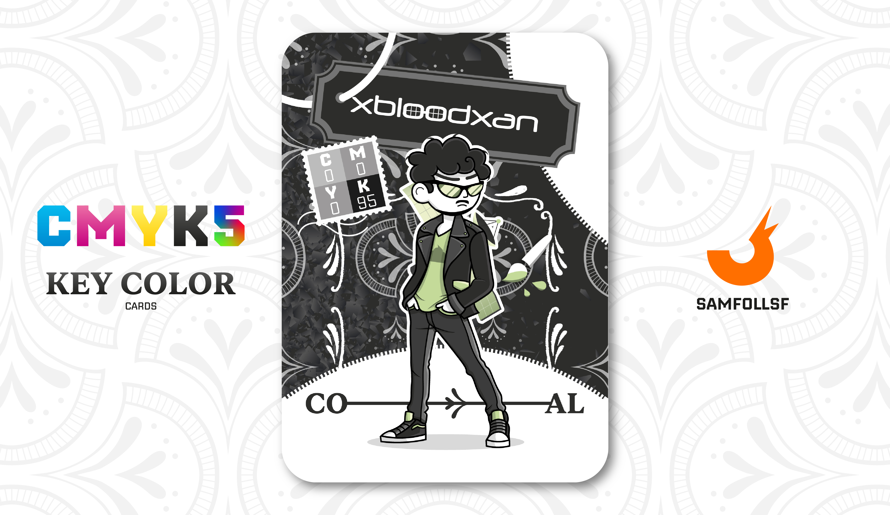

---
tags:
  - The Other Side

...

# XBloodXan

## Descrizione

I fuggitivi del [Deep Web Nascosto](../Remix/deep.md) hanno due opzioni per scappare. La prima, più rischiosa, consiste nell’utilizzare un foro clandestino nel sottosuolo del [Surface Web](../Remix/deep.md), con il pericolo costante di essere scoperti dalle forze dell’ordine e giustiziati. La seconda, più sicura ma costosa, è affidarsi a un broker, un intermediario che permette la fuga utilizzando una [Chiave Quadridimensionale](../Remix/tool.md).

XbloodXan è uno di questi broker, ma non possiede una [Chiave Quadridimensionale](../Remix/tool.md) personale: appartiene infatti alla It’s Web Company, la stessa organizzazione di [It’s Martin](../Giallo/martin.md) e [It’s Terry](../Ciano/itsterry.md). Ma come si entra in contatto con un broker?

Il processo è semplice: il pagamento avviene attraverso un tramite, chiamato Medium, che si muove nel [Deep Web Nascosto](../Remix/deep.md). Questi emissari sono sempre ben vestiti e difficili da derubare. Oltre a sapersi difendere, portano con sé dell’argento, una risorsa che nel [Deep Web Nascosto](../Remix/deep.md) li rende quasi divinità.

Solo quando un [Overthrown](../Remix/over.md) riesce a raccogliere la somma richiesta dall’Agent inviato dal broker, può finalmente ottenere l’accesso a un portale quadridimensionale e fuggire.

## Colore

Il carbone è stato il colore più vicino al nero che i paleolitici riuscirono a ottenere bruciando legni di vario tipo. Identifica ancora oggi il fumo e la fuliggine che annerirono il paesaggio urbano e i volti delle persone durante la Rivoluzione industriale del XIX secolo.

## Curiosità

- Come è possible vedere nella carta porta con sè un'Antenna Satellitare, utilizzata per mettersi con contatto con i Medium.
- Oltre che collega è anche amico di uno di questi Medium, ovvero PLACE HOLDER, maggiori informazioni nella sua carta.
- Sulla sua maglietta c'è un simbolo della cacca, ottenibile solo tramite il gruppo dell'accademia dedicato.
- XbloodXan è l'Agent di Gianni Scotto Di Carlo.

# Versione Mazzo 1.0