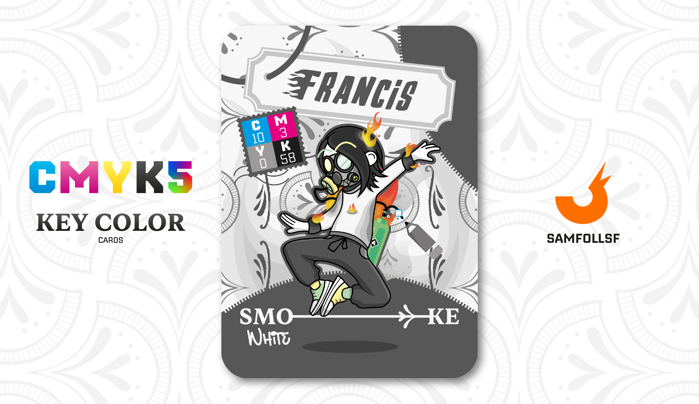

---
tags:
  - Pantera

...

# Francis

## Descrizione

Come ampiamente discusso nella carta di [MC6](../Giallo/mc6.md), che ci introduce le palestre del [Surface Web](../Remix/deep.md), l'"allenamento" qui non consiste nell'eseguire esercizi meccanici, ma nella ricerca nel proprio codice sorgente per individuare i parametri relativi all'estetica dell'Agent interessato.

Nella stessa carta di [MC6](../Giallo/mc6.md) si spiega come, a volte, gli Agent, anziché cercare i parametri estetici, trovino per puro caso (dato che il codice sorgente varia completamente da uno all'altro) i parametri relativi alla forza e alla resistenza, rendendoli immuni a esplosioni o proiettili ecc.. Questa pratica è severamente vietata e sorvegliata dai [Cavalieri di Rame](../Remix/metal.md) e guardie incaricate al controllo dei ricercatori, ma di tanto in tanto qualcuno riesce a fuggire con il bottino; Francis è uno di questi.

Caso volle che egli scoprì la stringa nel proprio codice relativa ai danni causati dal fuoco (sì, nel Web esiste il fuoco). Ciò che fece fu rimuovere ogni attributo negativo, diventando così capace di giocare con il fuoco a suo piacimento: può sia auto-incendiarsi sia utilizzare armi bianche completamente incendiate, essendo ora immune a tutto ciò che riguarda le fiamme.

## Colore

Simile al bianco anti-flash, viene anche chiamato "Bianco Fumo". Fa parte della nostra vita più di quanto ci immaginiamo. Il 4% di nero presente al suo interno ne attenua la luminosità e lo rende "impuro", sporco appunto.

## Curiosità

- Per alimentare le fiamme usa un particolare Gas Nobile, l'Argon, il quale esiste sia nel Web che nel mondo reale. La domanda sorge spontanea, come è possibile che l'Argon, un gas nobile, possa essere usato come combustibile infiammabile? Nelle [Palestre di Ricerca](../Giallo/mc6.md), più precisamente nei terminali, è possibile mettere mano non solo sui codici sorgenti degli Agent ma anche degli oggetti! È chiaramente una pratica proibita ma Francis è riuscito ugualmente a portarla a termine in maniera occulta, e ha creato per la prima volta nel Web e nell'universo un Gas Nobile infiammabile inedito: L'Argon Armonizzato Infiammabile. Inoltre è impossibile da rintracciare in quanto è come se fosse un Bug, un errore.
- E comunque sì, nel WebVerse esistono anche i Gas Nobili, ma questa è un'altra storia.
- Il suo design ricorda vagamente quello di Octane di Apex Legends, gioco al quale non ho mai giocato.
- Ha trovato il suo codice relativo alle fiamme in relativamente poco tempo, circa 4 mesi + 2 mesi per l'Argon Armonizzato Infiammabile.
- Per un periodo ha intrapeso la platinoterapia insieme a [Matteowsky](../Nero/matteowsky.md), ma la sua personalità schizzata non gli permetteva di stare in un posto nel silezio assoluto per più di 25 secondi.
- Francis è l'Agent di Francesco Scarpati.

# Versione Mazzo 1.0.1