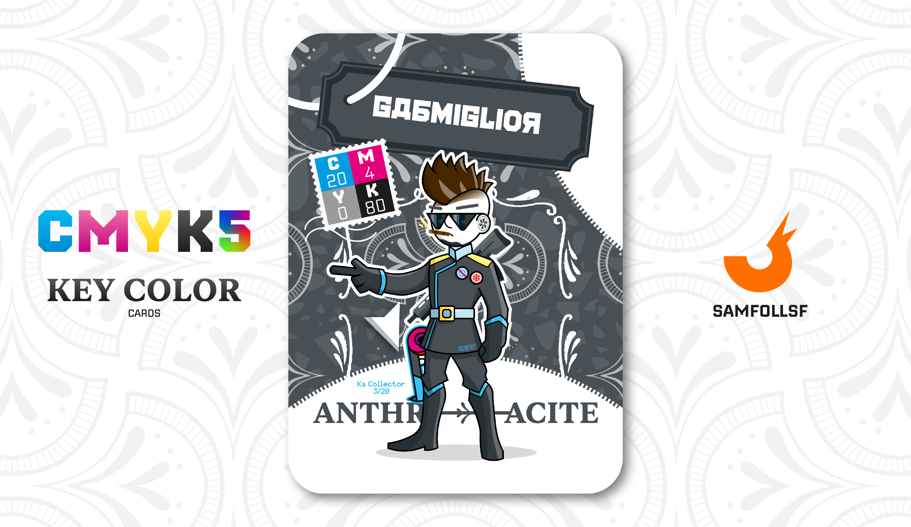

---
tags:
  - Red Winter

...

# Gabmiglior

## Descrizione

Anche Gabmiglior fa parte dell'Operazione [Red Winter](../Magenta/alesdreams.md), incaricata di rintracciare [Strumenti dei Fondatori](../Remix/tool.md) ottenuti illegalmente. La sua specialità è l’intercettazione delle [Forbici Copypasta](../Remix/tool.md), come quella in possesso di [SamFollSF](../Remix/samfollsf.md). Tuttavia, la verità è che a Gabmiglior non interessa realmente la causa: ha accettato questo lavoro solo perché gli consente di viaggiare nel [Surface Web](../Remix/deep.md) portando sempre con sé un’arma da fuoco, e poi ha un ottima conoscenza della lingua russa.

## Colore

L'associazione al metallo è quasi immediata. L'Antracite è protagonista di uno stile industriale e metropolitano proposto da molti architetti e interior designer. Più casual e portabile del nero, è stato per tanti anni il simbolo dell'abito maschile da ufficio.

## Curiosità

- Selezione: Ruba-Forbici, uno strumento unico, progettato per eliminare tutti gli oggetti duplicati e per "risucchiare" letteralmente le [Forbici](../Remix/tool.md) dai portachiavi, spezzando con precisione gli anelli che le tengono agganciate.
- È la persona più Transfobica, Razzista e Misogina che [SamFollSF](../Remix/samfollsf.md) conosca, e questo ha portato i due ad essere amici.
- Nella sua carta possiamo vederlo mentre fuma un Sigaro Cubano, ma come abbiamo detto a più riprese non lo sta veramente fumando perchè il fumo non esiste nel Web, è solo un oggetto decorativo.
- Indossa una spilla che prova che ha fatto parte a cortei negazionisti del Covid-19.
- Sul suo vestito ha una scritta in Cinese che significa "Crittografato".
- Gabmiglior è l'Agent di Gabriele Granillo.

# Versione Mazzo 1.0