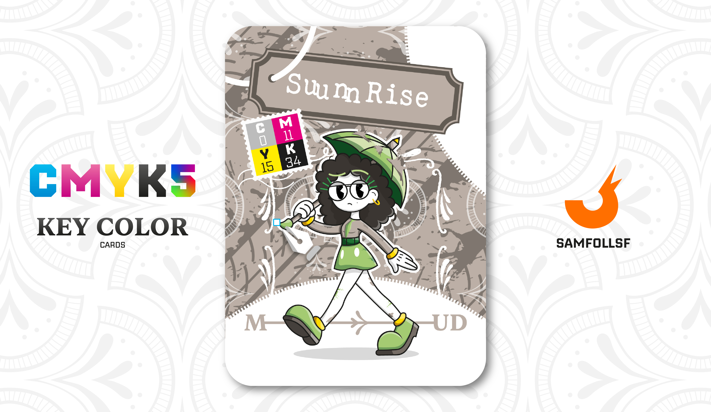

---
tags:
  - Pantera

...

# Suunnrise

## Descrizione

Suunnrise lavora come assistente sul set durante i live di [Geadamn](../Giallo/geadamn.md), ma prima di tutto sono grandi amiche. Era il 2021 quando, in passato, anche Suunnrise aveva provato a diventare un personaggio pubblico, partecipando come presentatrice a piccoli spettacoli con pochi spettatori. Tuttavia, il suo tentativo non ebbe successo e si concluse rapidamente. [Geadamn](../Giallo/geadamn.md), al contrario, è riuscita a costruire una carriera di successo, arrivando dove si trova oggi. Nonostante le difficoltà, l’esperienza fallimentare l'ha portata a conoscere [OpsGiuly](../Nero/opsg.md), che a sua volta aveva tentato di diventare presentatrice, ma senza successo.

## Colore

Il nome non gli rende giustizia: è in realtà raffinato e versatile, perfetto per diversi stili, dal rétro al contemporaneo. Strettamente imparentato con il tortora, la sua punta più calda lo rende meno indicato per gli ambienti di casa, perché tende a comprimere i volumi.

## Curiosità

- La sua amicizia con [OpsGiuly](../Nero/opsg.md) ha fatto crescere la lista nera di [SamFollSF](../Remix/samfollsf.md) di un nome.
- Una curiosità interessante è che condivide lo stesso stile grafico di [OpsGiuly](../Nero/opsg.md), e questa unione nasconde un easter egg: i colori rosso e verde richiamano il famoso duo Mario e Luigi di Nintendo. Tuttavia, la citazione più evidente resta quella a Walt Disney.
- Il suo ombrello ha un manico a forma di Pennello e la punta a forma di Matita: fa parte del merch ufficiale di [Geadamn](../Giallo/geadamn.md).
- Il colore "Mud" è l'unico che si distacca dalla scala di grigio, risultando essere più un beige.
- Suunnrise è l'Agent di Giada D'Ambrosio.

# Versione Mazzo 1.0