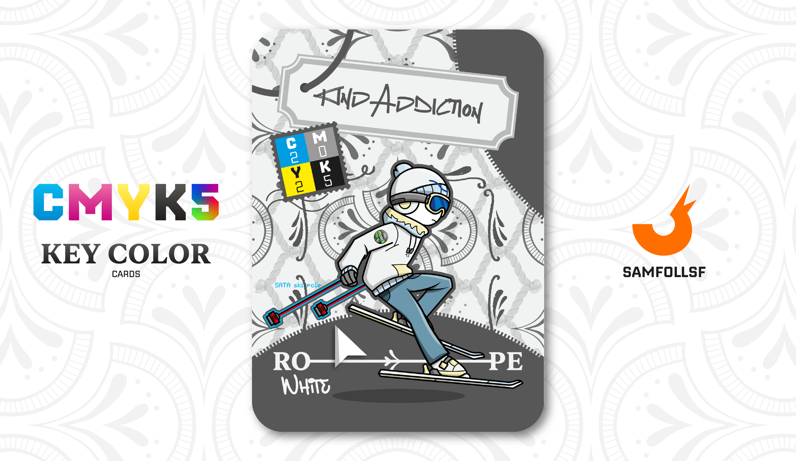

---
tags:
  - Street Art

...

# KindAddiction

## Descrizione (Non Ufficiale)

Nelle varie rappresentazioni del [Surface Web](../Remix/deep.md), abbiamo visto come attorno alla città e ai grattacieli si estendano immense distese di ghiacciai. Oltre a richiamare l’idea del Web come un iceberg, questi ghiacciai hanno anche una funzione pratica: dissipare il calore generato dalle attività di Agent, Manager e Nativi del Web, che operano in numeri da capogiro.

KindAddiction è un esploratore di queste zone remote del [Surface Web](../Remix/deep.md), solitamente desolate e disabitate. Si muove agilmente sulle distese innevate più a valle grazie ai "SATA ski pole".

## Colore

Un colore leggero, che ricorda il materiale da cui prende nome. Evoca il mare, le cime, gli schizzi ď'acqua, i legami... Il sottotono freddo e la particolare tonalità lo rendono perfetto per tessuti e materiali grezzi.

## Curiosità

- Selezione: Ma come funzionano questi "SATA ski pole"? Quando si vuole dare una spinta si invia una quanità enorme di dati, che non trovando un'unità di memoria, dissipa le infiormazioni sotto forma di elettricità che permette di alimentare le tavole. Le aste ad alta tensione sono ritenute armi a tutti gli effetti nel Web, e le aste SATA usate in questo modo permettono di aggirare la legge digitale.
- Sulla sua giacca è presente lo sticker della Circumflegrea "Pianura".
- Oltre che utilizzare gli scii, KindAddiction è abile anche sullo Skateboard e Snowboard.
- KindAddiction è l'Agent di Carlo Gentile.

# Versione Mazzo 1.0