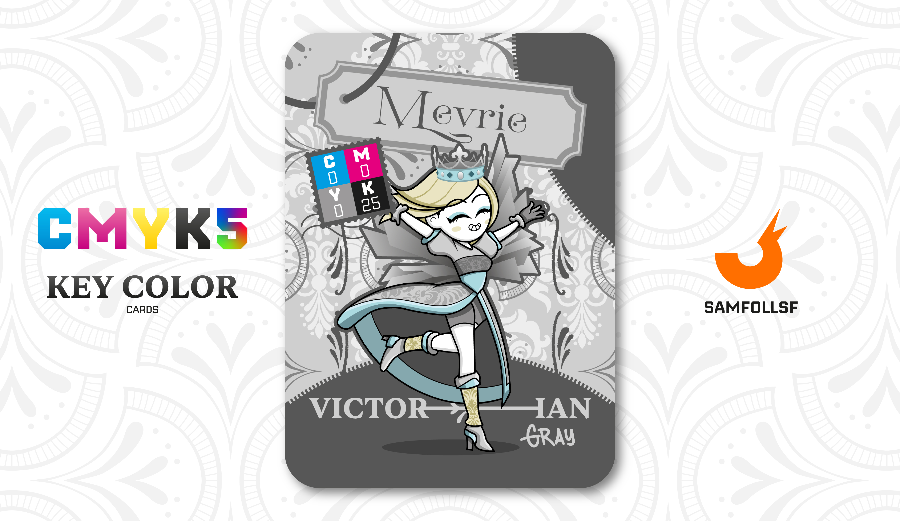

---
tags:
  - Frutiger Age

...

# Mevrie

## Descrizione

Ella è la principessa del blocco 136, proprio come [Golden](../Ciano/golden.md) regna nel blocco adiacente (il 136 invece del 137). I due sono in ottimi rapporti e, nella carta di [Golden](../Ciano/golden.md), il ruolo dei principi nel Web viene ampiamente discusso. Potreste pensare che queste figure regali e potenti siano naturalmente in contrasto con [SamFollSF](../Remix/samfollsf.md), ma il discorso è più complesso.

Infatti, nonostante il loro status di principi, che dovrebbe comportare il rispetto della legge, Mevrie e [Golden](../Ciano/golden.md) non devono per forza mettersi contro i criminali come [SamFollSF](../Remix/samfollsf.md), perché anche loro ignorano le regole e le leggi restrittive del [Surface Web](../Remix/deep.md). Durante il giorno si comportano come normali principi, impegnati in pratiche noiose, mentre di notte si concedono un lusso sfrenato nei club più prestigiosi dei blocchi vicini ai grandi [Ristagni d'acqua](../Remix/frutiger.md).

## Colore

Il Grigio Vittoriano è un grigio raffinato e senza tempo, ispirato all'eleganza dell'epoca vittoriana. Le sue sfumature delicate trasmettono un senso di sobria sofisticatezza, rendendolo perfetto per ambienti che uniscono tradizione e modernità.

## Curiosità

- A differenza di [Golden](../Ciano/golden.md), che è equipaggiato con indumenti in [oro](../Remix/metal.md), lei è invece vestita di indumenti [argentati](../Remix/metal.md), comunque più alta nella gerarchia del potere rispetto a [SamFollSF](../Remix/samfollsf.md)
- Nella trama si scoprirà come Mevrie sia molto più abile nei combattimenti corpo a corpo rispetto a [Golden](../Ciano/golden.md) che con tutto il rispetto è davvero una schiappa. 
- Tutto il suo vestito è ricamato di una texture vittoriana, ovviamente.
- Mevrie è l'Agent di Maria Di Foggia.

# Versione Mazzo 1.0.1