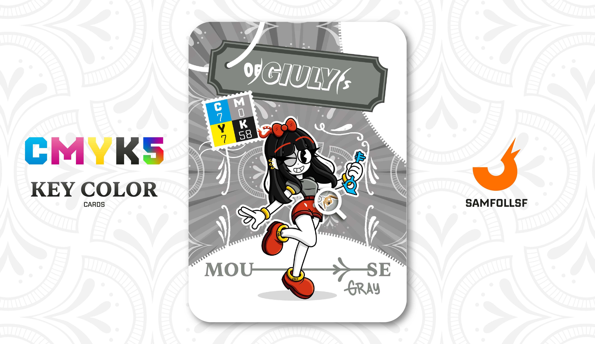

---
tags:
  - 272

...

# OpsGiuly

## Descrizione

OpsGiuly proviene dal Network 272, dove lo stile predominante è ispirato al cartoon vintage. È in possesso di una [Chiave Quadridimensionale](../Remix/tool.md), uno Strumento dei Fondatori che consente di creare Whormole, dei veri e propri teletrasporti che utilizzano scorciatoie spazio-temporali. In maniera sconsiderata, ha deciso di girare per il Web portando questo oggetto altamente illegale ben visibile, attirando così l’attenzione delle forze dell'ordine del [Surface Web](../Remix/deep.md), dell'Operazione [Red Winter](../Magenta/alesdreams.md) e di vari criminali desiderosi di impossessarsene.

[Ales Dreams](../Magenta/alesdreams.md) non riserverà alcuna clemenza verso [SamFollSF](../Remix/samfollsf.md) e OpsGiuly. Scaraventati nella stessa cella, i due intrecceranno i propri destini pianificando insieme un'evasione anche grazie all’aiuto di [Angy](../Giallo/angy.md), animati dall'ambizione non solo di fuggire dalle grinfie della Web Intelligence, ma di uscirne paradossalmente più ricchi, ottenendo una [Chiave](../Remix/tool.md), una [Forbice](../Remix/tool.md) e una [Bussola](../Remix/tool.md) a testa. I due criminali riusciranno nell'impresa da vincitori, oppure si ritroveranno a dover lottare l'uno contro l'altro come dei perdenti? La risposta è nel Volume IV: RED WINTER (Seconda Trilogia)

## Colore

Il Grigio Topo richiama il colore del manto dei roditori, ma è spesso usato nel gergo dei parrucchieri per denotare i capelli di base fredda, dal colore piuttosto indefinito (né castano né biondo né grigio).

## Curiosità

- Nel tempo libero gioca ad Animal Crossing, che gli permette di dissiociarsi e non pensare ai problemi della sua vita. E a dirla tutta non gioca solo nel tempo libero ma questi sono dettagli.
- Il suo nome è cambiato più volte nel corso degli anni, così come le attività che ha svolto nella sua vita. Ha iniziato nel 2015 gestendo una fan-page, poi si è dedicata al lavoro di traduttrice, fino ad arrivare a oggi, dove più che lavorare vive grazie ai soldi accumulati nel tempo.
- Ha un animale da compagnia, un piccolo orsacchiotto di nome "Biscottino".
- Nelle impostazioni dei suoi social ha rimosso ogni forma di conferma di visualizzazione, è praticamente un fantasma, non appare mai fisicamente nelle ChatRoom. (Un giorno approfondirò meglio questo punto).
- Sui suoi stivali ci sono due scritte che compongono la parola "Folloverse"

# Volume IV: RED WINTER