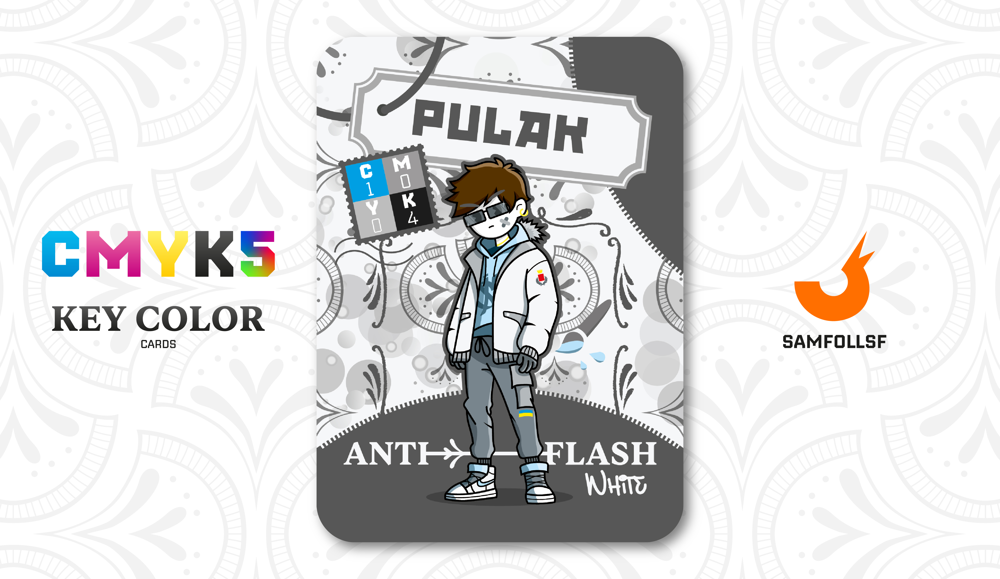

---
tags:
  - Fil di Ferro

...

# Pulak

## Descrizione

Pulak è stato un grande lavoratore, con un curriculum straordinario di cui può andare fiero. Tuttavia, il concetto di "lavoro" è ormai un capitolo del passato. Oggi, grazie ai soldi guadagnati, si gode la vita che ha sempre sognato: un’esistenza nel lusso sfrenato, senza preoccupazioni.

Tutto sembrerebbe perfetto, se non fosse che, in modo subdolo, la sua ricchezza sta distorcendo la sua percezione della realtà. Pulak ha iniziato a mettere in discussione persino i suoi amici, spinto da un desiderio insaziabile di accumulare sempre più denaro, come se fosse diventato una vera e propria droga.

## Colore

Chiamato anche bianco Munsell, il Bianco Anti-Flash negli anni '50 venne usato per dipingere gli aerei Boeing B-52 e ridurre le radiazioni termiche delle esplosioni nucleari. Si è poi iniziato a utilizzarlo come sfondo negli studi fotografici, proprio per ridurre l'effetto del flash.

## Curiosità
- Nonostante le sue ricchezze, ha deciso di conservare la sua prima automobile, una Seat Ibizia.
- Sul suo pantalone è presente una bandiera Ucraina.
- Si è sempre chiesto come mai sull'App Did Up sianno apparsi con una frequenza senza senso dei 2 in Inglese, che quella Prof ce l'avesse con la sua controparte reale?
- Ha ricevuto una chiamata per unirsi all'Operazione [Red Winter](../Magenta/alesdreams.md), ma credendo fosse una truffa ha rifiutato.
- Pulak è l'Agent di Raffaele Ilardo.

# Versione Mazzo 1.0